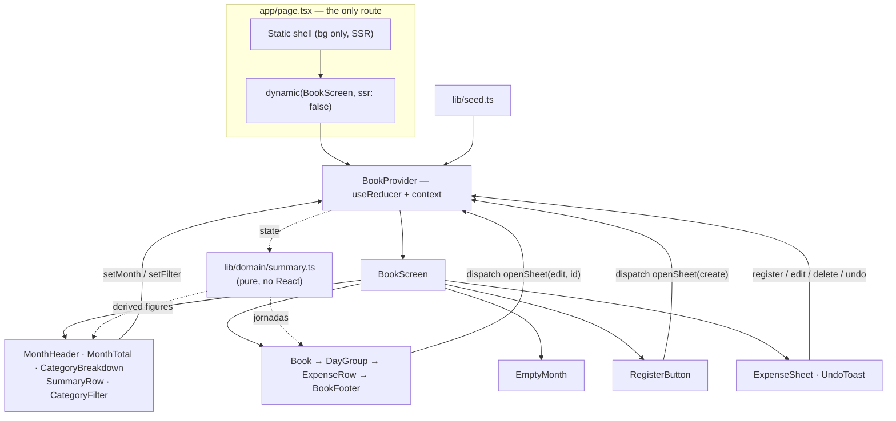

# Design — Monthly Expense Book (v1 prototype)

**Status:** In review
**Date:** 2026-09-03
**Requirements:** ./requirements.md

## Overview

The whole product is one route. `/` renders "el libro" for a viewed month, and
everything else — "la hoja", the undo notice — is a layer above it. There is no
navigation in the routing sense: changing month, filtering by category and
opening the sheet are all state transitions in a single client-side store, which
is what lets the book stay visible and recalculate behind the sheet (4.1, 2.13).

The state is a `useReducer` store held in one React context, seeded on mount and
never persisted (Requirement 10). Every number the header shows is *derived* on
render from that state by pure functions in `lib/domain/summary.ts` — nothing
aggregated is stored. That is deliberate: the "recompute after every mutation"
requirement (2.13) becomes free, because there is no aggregate that could fall
out of sync with the expenses, and every figure in Requirement 2 becomes a unit
test over a plain array with no React involved.

Dates are plain `YYYY-MM-DD` strings compared lexicographically, never `Date`
objects, and "today" is injected rather than read from the clock inside the
domain layer. Both choices exist to kill the same class of bug: a timezone
shifting an expense into the wrong day, and a test that passes only on the day
it was written.

Styling is CSS Modules over CSS custom properties generated one-to-one from the
`.pen` variables, so the token table in `CLAUDE.md` is literally the stylesheet
(11.4). Icons come from `lucide-react`, which is the icon set the mockup already
names its glyphs after.

## Architecture



This feature *is* the application: there is no existing codebase to fit into.
The structure is therefore chosen for what comes after it, not for what came
before — the domain layer (`lib/domain/`) knows nothing about React, and the
store is the only thing that would change when persistence replaces the
in-memory array in v2.

Two constraints shaped the structure:

- **One route, layered UI (Enfoque A).** The sheet cannot be a route, so it is a
  modal `<dialog>` sibling of the book inside the same tree, and the book never
  unmounts while it is open (4.1).
- **Client-only rendering.** The book's day labels depend on today's date
  (1.4), so server-rendering it risks a hydration mismatch when the server and
  the browser disagree about the day. `BookScreen` is loaded with
  `ssr: false`; the server renders only the page background so there is no white
  flash.

## Components and interfaces

### BookProvider (`state/book-store.tsx`)

- **Responsibility:** Owns all mutable state and is the only place that changes
  it.
- **Interface:**

```ts
type SheetState =
  | { mode: "closed" }
  | { mode: "create" }
  | { mode: "edit"; expenseId: string };

interface BookState {
  expenses: Expense[];
  viewedMonth: MonthKey;                       // "2026-09"
  filter: CategoryId | "todas";
  sheet: SheetState;
  pendingDeletion: Expense | null;             // the undo buffer
  today: IsoDate;                              // resolved once, at mount
}

type BookAction =
  | { type: "setMonth"; month: MonthKey }
  | { type: "setFilter"; filter: CategoryId | "todas" }
  | { type: "openSheet"; sheet: Exclude<SheetState, { mode: "closed" }> }
  | { type: "closeSheet" }
  | { type: "register"; draft: ExpenseDraft }
  | { type: "edit"; expenseId: string; draft: ExpenseDraft }
  | { type: "delete"; expenseId: string }
  | { type: "undoDelete" }
  | { type: "finalizeDelete" };

export function BookProvider(props: { children: React.ReactNode }): JSX.Element;
export function useBook(): { state: BookState; dispatch: React.Dispatch<BookAction> };
```

- **Traces to:** 1.1, 2.13, 4.6, 5.3, 6.1, 6.3, 6.5, 7.6, 8.1, 8.2, 10.1, 10.3,
  10.4, 10.5

`viewedMonth` is a single `MonthKey`, so "exactly one month at a time" (1.1) is
unrepresentable otherwise. There is no fetch, no server action and no route
handler anywhere in the tree, which is how 10.5 is satisfied — by having no
network surface at all rather than by not calling it.

The 5-second undo timer (6.4) lives in an effect inside the provider that
watches `pendingDeletion` and dispatches `finalizeDelete`, not in the reducer —
a reducer that schedules timers is no longer pure and no longer testable as one.

### `lib/domain/summary.ts`

- **Responsibility:** Turns a flat list of expenses into every figure the header
  and the list display. Pure, synchronous, React-free.
- **Interface:**

```ts
export function monthTotal(expenses: Expense[], month: MonthKey): number;

export function elapsedDays(month: MonthKey, today: IsoDate): number;

export function dailyAverage(
  expenses: Expense[], month: MonthKey, today: IsoDate,
): { amount: number; days: number } | null;          // null when the month is empty

export function monthComparison(
  expenses: Expense[], month: MonthKey,
): { direction: "less" | "more"; percent: number; previousMonth: MonthKey } | null;

export function categoryBreakdown(
  expenses: Expense[], month: MonthKey,
): Array<{ categoryId: CategoryId; total: number; share: number }>;  // desc by total

export function topCategory(
  expenses: Expense[], month: MonthKey,
): { categoryId: CategoryId; total: number } | null;

export function groupByDay(
  expenses: Expense[], month: MonthKey, filter: CategoryId | "todas",
): Array<{ date: IsoDate; subtotal: number; expenses: Expense[] }>;   // desc by date
```

- **Traces to:** 1.2, 1.3, 1.5, 2.1–2.12, 3.1, 7.4

`null` is the single signal for "no data" and every consumer maps it to the
`"—"` / `"sin datos"` treatment (2.9) or to hiding the block (2.11). Note that
`groupByDay` takes the filter but the other functions do not: that is 7.4 / 7.5
expressed in the type signatures rather than in a component's `if`.

### `lib/format.ts`

- **Responsibility:** Every string the user reads that is derived from a number
  or a date.
- **Interface:**

```ts
export function formatCop(amount: number): string;         // 1284500 -> "$1.284.500"
export function formatPercent(value: number): string;      // 9.04    -> "9,0%"
export function formatSharePercent(share: number): string; // 0.384   -> "38%"
export function formatMonthTitle(month: MonthKey): string; // -> "Septiembre 2026"
export function formatMonthUpper(month: MonthKey): string; // -> "SEPTIEMBRE 2026"
export function formatMonthLower(month: MonthKey): string; // -> "agosto"
export function formatDayStrip(date: IsoDate, today: IsoDate): string;
                                            // "HOY" | "AYER" | "1 DE SEPTIEMBRE"
export function parseAmountInput(raw: string): number;     // digits only, capped
```

- **Traces to:** 1.4, 1.9, 2.2, 2.3, 2.5, 2.7, 3.4, 8.3, 9.1–9.6

### MonthHeader

- **Responsibility:** Shows the viewed month and moves between months.
- **Interface:** `{ month: MonthKey; canGoForward: boolean; onPrev(): void; onNext(): void }`
- **Traces to:** 8.1, 8.2, 8.3, 8.4, 8.7

### MonthTotal

- **Responsibility:** `"TOTAL GASTADO"` plus the "comparativo" beneath it.
- **Interface:** `{ total: number; comparison: MonthComparison | null }`
- **Traces to:** 2.1, 2.5, 2.11, 3.4, 7.4

### CategoryBreakdown

- **Responsibility:** The proportional bar and its legend.
- **Interface:** `{ slices: BreakdownSlice[] }` — an empty array renders the
  collapsed neutral bar with no legend.
- **Traces to:** 2.6, 2.7, 2.8, 2.10

### SummaryRow

- **Responsibility:** The three-metric strip: `"MES ANTERIOR"`,
  `"PROMEDIO DIARIO"`, `"MÁS GASTADO"`.
- **Interface:**

```ts
{
  previousMonth: { total: number; month: MonthKey };
  dailyAverage: { amount: number; days: number } | null;
  topCategory: { categoryId: CategoryId; total: number } | null;
}
```

- **Traces to:** 2.2, 2.3, 2.4, 2.9

### CategoryFilter

- **Responsibility:** The chip row, including collapsing the surplus into
  `"+<N>"` and expanding it.
- **Interface:** `{ available: CategoryId[]; selected: CategoryId | "todas"; onSelect(f): void }`
- **Traces to:** 7.1, 7.2, 7.3

Expansion state is local to this component: it is view state with no effect on
any figure, so putting it in the store would only add an action nobody reads.

### Book / DayGroup / ExpenseRow / BookFooter

- **Responsibility:** Render the "jornadas" and the closing total; an
  `ExpenseRow` is the affordance that opens edit mode.
- **Interface:**

```ts
type BookProps      = { days: DayGroup[]; monthTotal: number; month: MonthKey;
                        today: IsoDate; onSelect(id: string): void };
type DayGroupProps  = { date: IsoDate; subtotal: number; expenses: Expense[];
                        today: IsoDate; onSelect(id: string): void };
type ExpenseRowProps = { expense: Expense; onSelect(id: string): void };
```

- **Traces to:** 1.2, 1.3, 1.4, 1.5, 1.6, 1.7, 1.8, 1.9, 5.1, 7.4

`ExpenseRow` resolves its own title: `expense.description || category.label`
(1.7, 1.8).

### EmptyMonth

- **Responsibility:** The whole empty-month body — heading with count `"0"`,
  message, three ruled lines, primary action, footer.
- **Interface:** `{ month: MonthKey; onRegister(): void }`
- **Traces to:** 3.1, 3.2, 3.3, 3.4, 8.5

### ExpenseSheet

- **Responsibility:** Capture and edit an expense. One component, two modes.
- **Interface:**

```ts
type ExpenseSheetProps =
  | { mode: "create"; defaultDate: IsoDate; onSubmit(d: ExpenseDraft): void; onDismiss(): void }
  | { mode: "edit"; expense: Expense; onSubmit(d: ExpenseDraft): void;
      onDelete(): void; onDismiss(): void };
```

- **Traces to:** 4.1, 4.2, 4.3, 4.4, 4.5, 4.6, 4.7, 4.8, 4.9, 4.10, 5.1, 5.2,
  5.3, 5.6, 6.1

Only `amountCop` and `categoryId` gate the confirm action; `description` and
`date` are optional and always carry a usable value (4.4).

Rendered as a native `<dialog>` opened with `showModal()`: that gives the focus
trap, Escape-to-dismiss and an inert background without writing any of it, and
the book stays mounted and visible behind the backdrop (4.1). Its child
`AmountField` uses `inputMode="numeric"` to raise the numeric keypad (4.2) and
formats as the user types (9.5).

### UndoToast

- **Responsibility:** Announce the deletion and offer the way back.
- **Interface:** `{ visible: boolean; onUndo(): void }`
- **Traces to:** 6.1, 6.3

## Data models

```ts
export type CategoryId =
  | "mercado" | "restaurantes" | "transporte" | "suscripciones" | "otros";

export type IsoDate  = string;   // "YYYY-MM-DD"
export type MonthKey = string;   // "YYYY-MM"

export interface Category {
  id: CategoryId;
  label: string;        // the Spanish name shown in the UI
  glyph: string;        // lucide icon name
  colorToken: string;   // CSS custom property name
}

export interface Expense {
  id: string;               // crypto.randomUUID()
  amountCop: number;        // positive integer, whole pesos
  categoryId: CategoryId;
  description?: string;     // optional; absent, not ""
  date: IsoDate;
  createdAt: number;        // epoch ms — orders expenses within a day
}

export interface ExpenseDraft {
  amountCop: number;
  categoryId: CategoryId;
  description?: string;
  date: IsoDate;
}
```

The fixed category table (`lib/domain/categories.ts`), in the order the design
uses for tie-breaking (2.12):

| `id` | `label` | `glyph` | `colorToken` |
|---|---|---|---|
| `mercado` | `"Mercado"` | `shopping-basket` | `--accent` |
| `restaurantes` | `"Restaurantes"` | `utensils` | `--accent-2` |
| `transporte` | `"Transporte"` | `bus` | `--accent-3` |
| `suscripciones` | `"Suscripciones"` | `repeat` | `--accent-4` |
| `otros` | `"Otros"` | `more-horizontal` | `--accent-5` |

Colour is bound to category *identity*, not to position: the breakdown bar is
ordered by share (2.6) but `"Mercado"` is `--accent` whatever its rank.

**Validation rules and invariants**

- `amountCop` is an integer ≥ 1 — traces to 4.7, 4.10
- `amountCop` ≤ 999_999_999; further typed digits are ignored — traces to 9.6
- `categoryId` is one of the five fixed values, never free text — traces to 4.3
- `description` is omitted when blank, never stored as `""`, so 1.8's fallback
  is a single `||` and not a whitespace check — traces to 1.7, 1.8
- `date` is a valid `YYYY-MM-DD`; it is never parsed into a `Date` for
  comparison or grouping — traces to 1.2, 1.4
- Order within a day is `createdAt` descending, so restoring an undone deletion
  lands in its original position with no stored index — traces to 1.3, 6.3
- No aggregate (month total, category total, count) is ever stored — traces to
  2.13
- `viewedMonth` never exceeds the month containing `today` — traces to 8.4

## Data flow

### Scenario: registering an expense in the current month (Requirement 4)

1. User taps `"Registrar"` → `RegisterButton` → `dispatch({type:"openSheet",
   sheet:{mode:"create"}})`.
2. `BookScreen` sees `state.sheet.mode === "create"` → renders `ExpenseSheet`
   with `defaultDate` = `today` (viewed month is the current month) → the
   `<dialog>` opens and focus lands on the amount field with the numeric keypad
   (4.2, 4.5).
3. User types `48500` → `AmountField` runs `parseAmountInput` → displays
   `"$48.500"` (9.5); confirm is still disabled because no chip is selected
   (4.8).
4. User taps the `"Mercado"` chip → confirm enables (4.6 preconditions met).
5. User confirms → `dispatch({type:"register", draft})` → the reducer appends an
   `Expense` with a fresh `id` and `createdAt: Date.now()` and sets
   `sheet: {mode:"closed"}`.
6. `BookScreen` re-renders: `groupByDay` puts the new expense first inside the
   `"HOY"` "jornada" (1.3, 1.4); `monthTotal`, `dailyAverage`,
   `monthComparison`, `categoryBreakdown` and `topCategory` all recompute from
   the same array.
7. Observable outcome: the sheet closes, the row is visible under `"HOY"`, and
   every header figure has moved — satisfies 4.1, 4.2, 4.5, 4.6, 2.13.

### Scenario: registering while viewing a past month (criterion 4.5)

1. User navigates back to July 2026 → `dispatch({type:"setMonth", month:"2026-07"})`
   → the book shows the empty state (8.5, 3.1) and the filter resets (7.6).
2. User taps `"Registrar un gasto"` in the empty state → the sheet opens with
   `defaultDate` = `"2026-07-01"`, the first day of the *viewed* month, not
   today.
3. User confirms → the expense is dated in July.
4. Observable outcome: the empty state is replaced by a book containing one
   "jornada" labelled `"1 DE JULIO"` — satisfies 4.5, 3.5, 1.4.

### Scenario: deleting and undoing (Requirement 6)

1. User taps an expense row → `dispatch({type:"openSheet", sheet:{mode:"edit",
   expenseId}})` → the sheet opens pre-filled with `"Eliminar"` at its foot
   (5.1, 5.2).
2. User taps `"Eliminar"` → `dispatch({type:"delete", expenseId})` → the reducer
   removes it from `expenses`, moves it to `pendingDeletion`, and closes the
   sheet.
3. The book re-renders without the row and with every figure recomputed as if
   the deletion were final (6.2). `UndoToast` becomes visible; the provider's
   effect schedules `finalizeDelete` in 5 s.
4a. User taps undo within 5 s → `dispatch({type:"undoDelete"})` → the expense is
    pushed back into `expenses`; because ordering derives from `date` and
    `createdAt`, it reappears exactly where it was (6.3).
4b. No tap → the timer fires `finalizeDelete` → `pendingDeletion` becomes
    `null` and the expense is gone for the session (6.4).
5. Observable outcome in the 4b branch where it was the month's last expense:
   the empty state is showing — satisfies 6.6, 3.6.

### Scenario: an edit that moves the expense to another month (criterion 5.4)

1. User opens a September expense in edit mode and changes its date to
   `"2026-08-28"`.
2. User confirms → the reducer applies the edit *and*, seeing the new date's
   month differs from `viewedMonth`, sets `viewedMonth` to `"2026-08"`.
3. Observable outcome: the book is showing August with the edited expense in
   its "jornada", instead of the row silently vanishing from September —
   satisfies 5.4.

## Error handling

| Condition | Handling | Related requirement |
|---|---|---|
| Expense has no description | Row title falls back to the category label | 1.8 |
| A category has no expenses this month | Omitted from the bar and legend by `categoryBreakdown` | 2.8 |
| Month has no expenses | `dailyAverage` / `topCategory` return `null`; `SummaryRow` renders `"—"` + `"sin datos"` | 2.9 |
| Month has no expenses | `categoryBreakdown` returns `[]`; the bar renders one `--divider` segment, legend hidden | 2.10 |
| This or the previous month is empty | `monthComparison` returns `null`; `MonthTotal` renders no "comparativo" | 2.11 |
| Two categories tie for highest | `topCategory` breaks the tie by the fixed category order | 2.12 |
| Viewed month has no expenses | `BookScreen` renders `EmptyMonth` instead of `Book` | 3.1, 8.5 |
| Amount empty or zero | Confirm stays disabled; no dispatch is possible | 4.7 |
| No category selected | Confirm stays disabled | 4.8 |
| Sheet dismissed without confirming | `dispatch({type:"closeSheet"})` only; the draft lives in the sheet's local state and dies with it | 4.9, 5.6 |
| Typed amount would exceed 999.999.999 | `parseAmountInput` keeps only the first nine digits, so the extra one never reaches state | 9.6 |
| Edited date falls outside the viewed month | Expense moves and the book navigates to its new month | 5.4 |
| Edited date falls on another day of the same month | Re-grouped by `groupByDay`; no special case needed | 5.5 |
| Undo notice expires | Provider effect dispatches `finalizeDelete` after 5 s | 6.4 |
| Second delete while a notice is visible | The reducer finalizes the pending one before storing the new one | 6.5 |
| Last expense of the month deleted | Empty state renders; undo restores the book | 6.6, 3.6 |
| More than four filter chips | Surplus collapses into `"+<N>"`, expandable in place | 7.3 |
| Selected category's last expense deleted | Reducer resets `filter` to `"todas"` in the same action | 7.7 |
| Viewed month is the current month | Next-month control disabled | 8.4 |
| Viewport wider than 390px | Book centred in a 390px column | 11.3 |
| Page reloaded | Nothing was persisted; the store re-seeds | 10.3, 10.4 |

## Testing strategy

Vitest with jsdom, plus `@testing-library/react` for the component level. The
domain layer needs no DOM at all, which is the point of extracting it.

**Unit — `lib/domain/summary.ts` (no React)**

- `monthTotal` over a mixed-month fixture — covers 2.1
- `elapsedDays` for the current month (day-of-month) vs a past month (full
  length), including February — covers 2.3
- `dailyAverage` returning `null` for an empty month — covers 2.3, 2.9
- `monthComparison` in both directions, and `null` when either side is empty —
  covers 2.5, 2.11
- `categoryBreakdown` ordering by share and omitting absent categories — covers
  2.6, 2.8
- `categoryBreakdown` returning `[]` for an empty month — covers 2.10
- `topCategory` including the tie case — covers 2.4, 2.12
- `groupByDay` ordering days desc and expenses by `createdAt` desc — covers 1.2,
  1.3, 1.5
- `groupByDay` with a category filter applied — covers 7.4

**Unit — `lib/format.ts`**

- `formatCop` for 0, thousands, millions — covers 9.1, 9.2
- `formatPercent` / `formatSharePercent` — covers 9.3, 2.7
- `formatDayStrip` for today, yesterday, and an older day — covers 1.4
- `formatMonthTitle` / `Upper` / `Lower` — covers 2.2, 3.4, 8.3, 9.4
- `parseAmountInput` rejecting non-digits and capping at 999.999.999 — covers
  9.5, 9.6, 4.10

**Edge cases**

- An expense dated the 1st and the last day of a month, to prove no `Date`
  timezone drift moves it — covers 1.2, 1.4
- Empty description stored as absent, not `""` — covers 1.7, 1.8
- A month with exactly one expense (share 100%, average = total) — covers 2.6,
  2.3
- Undo after the timer fired is a no-op — covers 6.4
- Deleting the last expense while a category filter is active — covers 6.6, 7.7

**Integration (React Testing Library)**

- Register: open sheet → confirm disabled → type amount → still disabled → pick
  category → confirm → row present under `"HOY"` and total updated — covers
  4.1–4.3, 4.6–4.8, 2.13
- Register from a past month uses day 1 of that month — covers 4.5, 3.5
- Dismiss without confirming leaves the book untouched — covers 4.9, 5.6
- Edit an expense's amount and category, in place — covers 5.1, 5.3
- Edit into another month navigates the book there — covers 5.4
- Delete → toast → undo restores the row in position — covers 6.1, 6.3
- Delete → let the timer run → row is gone and empty state appears — covers 6.4,
  6.6, 3.1
- Filter selects a category: list and `"TOTAL GASTADO"` change, `"MÁS GASTADO"`
  does not — covers 7.4, 7.5
- `"+<N>"` chip expands to reveal the rest — covers 7.3
- Month navigation resets the filter and disables forward on the current month —
  covers 7.6, 8.1, 8.2, 8.4, 8.6
- Empty month renders the message, the count `"0"` and the footer — covers 3.2,
  3.3, 3.4
- Seed contains three months with July empty — covers 10.1, 10.2
- No `fetch`, server action or route handler exists in the tree — covers 10.5

**Manual**

- Side-by-side against frames `zKnc1` and `s2nLha` at 390px — covers 1.10, 11.1,
  11.4
- Install to a phone home screen — covers 11.2

## Design decisions and trade-offs

### Derive every figure; store only expenses

- **Rationale:** 2.13 requires every number to be correct after any mutation.
  With no stored aggregate there is nothing that *can* be stale, and Requirement
  2 becomes nine pure-function tests instead of a set of reducer assertions. At
  prototype data volume the cost is nil.
- **Alternative considered:** caching totals per month in the store. It would
  buy nothing measurable and would add an invalidation path to get wrong on
  every one of the five mutating actions.

### CSS Modules over CSS custom properties, not Tailwind

- **Rationale:** 11.4 makes the `.pen` token table the source of truth. Emitting
  those tokens once as custom properties in `globals.css` means a token change
  is a one-line change. The mockup's values are also specific (17px icons, an
  8px bar, a 1px hairline) and in Tailwind most would become arbitrary values,
  which is the notation at its least readable.
- **Alternative considered:** Tailwind v4 with the tokens in `@theme`. Faster to
  write, but it invites hardcoding a colour that is not in the token table,
  which is exactly what 11.4 forbids.

### The sheet is a native `<dialog>`

- **Rationale:** focus trap, Escape, backdrop and inert background come for
  free, and the book stays mounted behind it as 4.1 requires.
- **Alternative considered:** a fixed-position div. Cheaper to style as a bottom
  sheet, but the focus management would have to be written by hand, and getting
  it wrong makes the 10-second flow unusable with a keyboard.

### `ssr: false` for the book subtree

- **Rationale:** day labels depend on today (1.4). Server-rendering them risks a
  hydration mismatch across midnight or a timezone gap, which React resolves by
  silently re-rendering — with a wrong label visible in between.
- **Alternative considered:** SSR with a suppressed hydration warning. It hides
  the symptom and leaves the wrong label on screen.

### `today` is injected into the domain layer, never read from the clock

- **Rationale:** `elapsedDays`, `dailyAverage` and `formatDayStrip` all depend on
  it. Passing it in makes every one of their tests deterministic instead of
  passing only on the day they were written.
- **Alternative considered:** calling `new Date()` inside the functions and
  faking timers in tests. It works, but it makes an impure function look pure,
  which is the trap the whole `lib/domain/` split exists to avoid.

### Dates as `YYYY-MM-DD` strings

- **Rationale:** grouping and month filtering become string comparison and
  `slice(0, 7)`. No timezone can move an expense into the wrong day, which is
  the classic bug in exactly this kind of app.
- **Alternative considered:** `Date` objects or a date library. Both add a
  dependency and a UTC-vs-local decision to get wrong, for a prototype that
  never does date arithmetic beyond "which month is this" and "how many days has
  this month had".

### Filter state in the store, chip-expansion state in the component

- **Rationale:** the filter changes what `groupByDay` returns and must reset on
  month change (7.6); expansion changes nothing anyone computes.
- **Alternative considered:** all UI state in the store. Uniform, but it grows
  the action union with transitions no test would ever assert.
