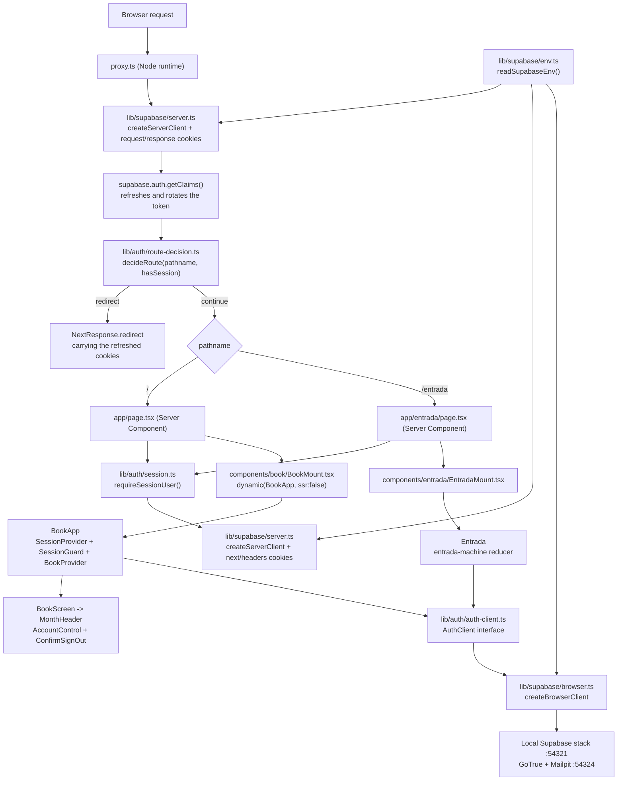

# Design — Supabase Auth sign-in

**Status:** Approved
**Date:** 2026-09-04
**Requirements:** ./requirements.md

## Overview

The account is introduced as a **route boundary**, not as a conditional inside
the existing screen. Two routes exist after this feature: `/` is "el libro" and
`/entrada` is the sign-in screen. Which one a request gets is decided on the
server, from the session cookie, before any HTML is produced — that is the whole
answer to criteria 4.2, 4.3 and 4.4, and it is why the decision does not live in
a `useEffect`.

The session lives in cookies written by `@supabase/ssr`, so the same credential
is visible to the server-rendered and the client-rendered halves of the app
(5.4). Next 16 replaced `middleware.ts` with `proxy.ts`; the proxy is where the
access token is refreshed, because Server Components cannot write cookies. The
proxy also performs the optimistic redirect, and `app/page.tsx` repeats the
check through a small server-only data access layer so the gate does not depend
on the matcher being right.

"La entrada" is a two-step client screen — email, then code — driven by a pure
reducer (`lib/auth/entrada-machine.ts`) over an injected `AuthClient` interface.
Everything network-shaped is behind that interface, which is what makes the
seven criteria of Requirement 3 and the four of Requirement 8 testable under
vitest + jsdom without a running stack. The real implementation calls
`signInWithOtp` and `verifyOtp`; a fake implementation is what the component
tests see.

The local stack is a committed `supabase/config.toml` plus a committed
`supabase/templates/magic_link.html` that prints `{{ .Token }}`, which is what
turns Supabase's one email mechanism from a magic link into a six-digit code.
Nothing else about the database changes: no tables, no migrations, no seeds —
this feature is the account and nothing more.

The one piece of existing behaviour that this feature must resolve rather than
inherit is `app/page.tsx`'s `dynamic(..., { ssr: false })`. It stays, for the
reason v1 introduced it, but it moves down a level so the route itself can be a
Server Component. See *The gate is the route; `ssr: false` moves below it*.

## Architecture



**Boundaries.** This feature owns everything under `lib/supabase/`,
`lib/auth/`, `components/entrada/`, `app/entrada/`, `proxy.ts`, `supabase/`
and `.env.example`. It *talks to* three things it does not own: `app/page.tsx`
(turned into a Server Component gate), `components/book/MonthHeader.tsx`
(gains one optional slot) and `components/book/BookApp.tsx` (gains the session
providers). It does not touch `state/book-store.tsx`, `lib/domain/**` or
`lib/seed.ts` at all — the book's behaviour is unchanged, as the introduction of
`requirements.md` requires.

**Constraints from the existing codebase that shaped this structure.**

1. **Next 16 renamed `middleware` to `proxy`.** The file is `proxy.ts` at the
   repository root (beside `app/`), the export is named `proxy`, and the runtime
   is Node.js and cannot be configured — setting `runtime` throws. Every
   Supabase + Next.js tutorial in circulation says `middleware.ts`; that advice
   is wrong for this repository.
2. **Server Components cannot write cookies.** The server client's `setAll` is
   therefore a no-op guarded by `try/catch` when it is constructed from
   `next/headers`, and all token rotation happens in the proxy.
3. **`next/dynamic` with `ssr: false` is not allowed in a Server Component.**
   Making `app/page.tsx` a Server Component forces the `dynamic()` call down
   into a new `"use client"` module, `components/book/BookMount.tsx`.
4. **`app/__tests__/no-stray-colours.test.ts` asserts the app has no network
   surface at all.** That assertion encodes v1's criterion 10.5 and is false the
   moment this feature exists. It is re-scoped, not deleted — see
   *Re-scope the v1 network guard rather than delete it*.
5. **The book header has exactly one free slot.** v1 removed the search icon
   (its criterion 8.7), leaving the right of `MonthHeader` empty. `"Cerrar
   sesión"` goes there (6.1), as `requirements.md` resolved.
6. **The test harness is vitest + jsdom + Testing Library, with no end-to-end
   runner.** Every seam in this design that could have been a network call is an
   injectable interface instead, because that is the only way these criteria get
   tested at all.

## Components and interfaces

### `lib/supabase/env.ts`

- **Responsibility:** produce the two Supabase connection values, or fail
  naming the variable that is missing.
- **Interface:**

```ts
export interface SupabaseEnv {
  url: string;
  anonKey: string;
}

export class MissingEnvError extends Error {
  readonly variable: string;
  constructor(variable: string);
}

/**
 * `source` exists for tests only. The default reads the two variables as
 * literal `process.env.NEXT_PUBLIC_*` member expressions, because Next inlines
 * them at build time by textual substitution — a dynamic `process.env[name]`
 * lookup silently yields `undefined` in the browser bundle.
 */
export function readSupabaseEnv(
  source?: Record<string, string | undefined>,
): SupabaseEnv;
```

- **Traces to:** 1.4, 1.6, 1.8

### `lib/supabase/browser.ts`

- **Responsibility:** build the browser-side Supabase client that stores the
  session in cookies.
- **Interface:**

```ts
import type { SupabaseClient } from "@supabase/supabase-js";

/** `createBrowserClient` from `@supabase/ssr`; memoised per module load. */
export function createSupabaseBrowserClient(): SupabaseClient;
```

- **Traces to:** 1.4, 5.1, 5.4

### `lib/supabase/server.ts`

- **Responsibility:** build a Supabase client bound to a request's cookies, in
  the two shapes the server needs.
- **Interface:**

```ts
import type { SupabaseClient } from "@supabase/supabase-js";
import type { NextRequest, NextResponse } from "next/server";

/**
 * For Server Components and the DAL. Reads cookies through `next/headers`.
 * `setAll` is a no-op wrapped in try/catch: a Server Component may not write
 * cookies, and the proxy has already refreshed the token for this request.
 */
export function createSupabaseServerClient(): Promise<SupabaseClient>;

/**
 * For `proxy.ts`. Reads from `request.cookies` and writes to BOTH the request
 * (so the same invocation sees the new value) and the response (so the browser
 * receives it).
 */
export function createSupabaseProxyClient(
  request: NextRequest,
  response: NextResponse,
): SupabaseClient;
```

- **Traces to:** 4.2, 4.4, 5.3, 5.4

### `lib/auth/config.ts`

- **Responsibility:** hold the four numbers the UI states out loud, next to the
  `supabase/config.toml` keys they must equal.
- **Interface:**

```ts
/** `[auth.email] otp_length` in supabase/config.toml. */
export const CODE_LENGTH = 6;

/** `[auth.email] otp_expiry`, in seconds. How long "el código" stays valid. */
export const CODE_TTL_SECONDS = 600;

/** `[auth.email] max_frequency`, in seconds. The cooldown between sends. */
export const RESEND_COOLDOWN_SECONDS = 60;

/** How long the app waits for the auth service before giving up (8.2). */
export const AUTH_TIMEOUT_MS = 10_000;
```

- **Traces to:** 2.7, 3.2, 3.5, 3.6, 8.2

### `lib/auth/errors.ts`

- **Responsibility:** turn anything the auth service can throw into one of a
  closed set of failures, and each failure into one Spanish sentence.
- **Interface:**

```ts
export type AuthFailure =
  | { kind: "empty-email" }
  | { kind: "invalid-email" }
  | { kind: "rate-limited" }
  /** The provider conflates "wrong" and "expired"; the reducer refines it. */
  | { kind: "code-unverified" }
  | { kind: "code-rejected" }
  | { kind: "code-expired" }
  | { kind: "unreachable" }
  | { kind: "timeout" }
  | { kind: "unknown" };

/** Maps a thrown value — AuthError, TypeError, TimeoutError — to a failure. */
export function toAuthFailure(error: unknown): AuthFailure;

/**
 * The only text a user ever sees for a failure. `isDevelopment` adds the
 * stopped-local-stack hint (8.3). No provider string is ever passed through
 * (7.6).
 */
export function describeFailure(
  failure: AuthFailure,
  isDevelopment: boolean,
): string;
```

- **Traces to:** 2.3, 2.7, 3.4, 3.5, 3.7, 7.4, 7.6, 8.1, 8.2, 8.3

### `lib/auth/auth-client.ts`

- **Responsibility:** the three auth operations this app performs, as an
  interface that never throws and never returns a provider type.
- **Interface:**

```ts
import type { SessionUser } from "@/lib/auth/types";
import type { AuthFailure } from "@/lib/auth/errors";

export type Result<T> =
  | { ok: true; value: T }
  | { ok: false; failure: AuthFailure };

export interface AuthClient {
  /** signInWithOtp({ email, options: { shouldCreateUser: true } }) */
  requestCode(email: string): Promise<Result<void>>;
  /** verifyOtp({ email, token, type: "email" }) */
  verifyCode(email: string, code: string): Promise<Result<SessionUser>>;
  /** signOut(); on failure retries with { scope: "local" } (6.4). */
  signOut(): Promise<Result<void>>;
}

export function createSupabaseAuthClient(): AuthClient;

/** Rejects with a TimeoutError after `ms`, so a hung request cannot hang the UI. */
export function withTimeout<T>(work: Promise<T>, ms: number): Promise<T>;
```

- **Traces to:** 2.2, 2.4, 2.5, 3.3, 6.4, 8.1, 8.2

### `lib/auth/validate-email.ts`

- **Responsibility:** decide, without contacting anything, whether an address is
  worth sending.
- **Interface:**

```ts
/** `null` when the address is acceptable. */
export function validateEmail(raw: string): AuthFailure | null;
```

- **Traces to:** 2.3

### `lib/auth/entrada-machine.ts`

- **Responsibility:** own every transition of the two-step sign-in screen.
- **Interface:**

```ts
import type { AuthFailure } from "@/lib/auth/errors";

export interface EntradaState {
  step: "email" | "code";
  email: string;
  code: string;
  status: "idle" | "sending" | "verifying";
  failure: AuthFailure | null;
  /** Epoch ms of the last successful send; drives expiry and cooldown. */
  codeSentAt: number | null;
}

export type EntradaAction =
  | { type: "editEmail"; value: string }
  | { type: "submitEmail" }
  | { type: "codeSent"; now: number }
  | { type: "editCode"; value: string }
  | { type: "submitCode" }
  | { type: "verified" }
  | { type: "failed"; failure: AuthFailure; now: number }
  | { type: "resend" }
  | { type: "backToEmail" };

export function initialEntradaState(): EntradaState;
export function entradaReducer(
  state: EntradaState,
  action: EntradaAction,
): EntradaState;

/** Seconds left before another code may be requested; 0 when free. */
export function cooldownRemaining(state: EntradaState, now: number): number;

/** True once CODE_TTL_SECONDS have passed since `codeSentAt`. */
export function codeHasExpired(state: EntradaState, now: number): boolean;
```

- **Traces to:** 2.3, 2.6, 2.7, 3.1, 3.4, 3.5, 3.6, 8.4

### `lib/auth/route-decision.ts`

- **Responsibility:** decide, from a path and a boolean, which screen a request
  is entitled to.
- **Interface:**

```ts
export const ENTRADA_PATH = "/entrada";
export const LIBRO_PATH = "/";

export type RouteDecision =
  | { kind: "continue" }
  | { kind: "redirect"; to: string };

export function decideRoute(input: {
  pathname: string;
  hasSession: boolean;
}): RouteDecision;
```

- **Traces to:** 4.1, 4.3, 5.1, 5.5

### `proxy.ts` (repository root)

- **Responsibility:** refresh the session on every navigation and enforce the
  route decision before a page renders.
- **Interface:**

```ts
import type { NextRequest } from "next/server";

// Next 16: the file is `proxy.ts`, the export is `proxy`, the runtime is
// Node.js and is not configurable.
export async function proxy(request: NextRequest): Promise<Response>;

export const config = {
  // Everything except static assets and the files an uninstalled PWA needs to
  // read while signed out.
  matcher: [
    "/((?!_next/static|_next/image|favicon.ico|manifest.webmanifest|.*\\.png$).*)",
  ],
};
```

The refreshed cookies are written onto a `NextResponse.next()` created up front;
when `decideRoute` asks for a redirect, those cookies are **copied onto the
redirect response** before it is returned. Skipping that copy is the standard
way this pattern silently loses the rotated token.

- **Traces to:** 4.1, 4.2, 4.3, 5.1, 5.3, 5.4, 5.5

### `lib/auth/session.ts` (server-only)

- **Responsibility:** answer "who is signed in on this request", for Server
  Components.
- **Interface:**

```ts
import "server-only";
import type { SessionUser } from "@/lib/auth/types";

/** Memoised per render pass with React `cache`. Never throws on absence. */
export function getSessionUser(): Promise<SessionUser | null>;

/** `getSessionUser()`, but redirects to "/entrada" instead of returning null. */
export function requireSessionUser(): Promise<SessionUser>;
```

- **Traces to:** 4.2, 4.4, 4.5, 5.1

### `state/session-context.tsx`

- **Responsibility:** carry the signed-in identity and the sign-out action to
  the client components that need them.
- **Interface:**

```ts
import type { SessionUser } from "@/lib/auth/types";

export interface SessionValue {
  user: SessionUser;
  signOut: () => Promise<void>;
}

export function SessionProvider(props: {
  value: SessionValue;
  children: ReactNode;
}): ReactNode;

/**
 * `null` outside a provider — deliberately not a throw, unlike `useBook()`.
 * It lets `BookScreen` keep rendering in the v1 tests, where the account
 * control is simply absent.
 */
export function useSession(): SessionValue | null;
```

- **Traces to:** 4.5, 6.1

### `components/entrada/Entrada.tsx`

- **Responsibility:** render the two steps and drive the reducer from the
  injected client.
- **Interface:**

```ts
import type { AuthClient } from "@/lib/auth/auth-client";

export interface EntradaProps {
  client: AuthClient;
  /** Called after a successful verification; the mount navigates to "/". */
  onSignedIn: () => void;
  /** Injected so tests are not at the mercy of the wall clock. */
  now?: () => number;
  isDevelopment?: boolean;
}

export function Entrada(props: EntradaProps): ReactNode;
```

- **Traces to:** 2.1, 2.2, 2.3, 2.6, 3.1, 3.3, 7.5, 8.4

### `components/entrada/EmailStep.tsx`

- **Responsibility:** the email field and its submit control.
- **Interface:**

```ts
export interface EmailStepProps {
  email: string;
  busy: boolean;
  message: string | null;
  onChange: (value: string) => void;
  onSubmit: () => void;
}

export function EmailStep(props: EmailStepProps): ReactNode;
```

The input carries `autoFocus`, `type="email"`, `inputMode="email"`,
`autoComplete="email"` and `aria-describedby` pointing at the inline message.

- **Traces to:** 2.1, 2.3, 2.6, 7.5, 7.6

### `components/entrada/CodeStep.tsx`

- **Responsibility:** the code field, the resend affordance and the way back.
- **Interface:**

```ts
export interface CodeStepProps {
  email: string;
  code: string;
  busy: boolean;
  message: string | null;
  /** Seconds until another code may be requested; 0 enables the resend. */
  cooldown: number;
  onChange: (value: string) => void;
  onSubmit: () => void;
  onResend: () => void;
  onBack: () => void;
}

export function CodeStep(props: CodeStepProps): ReactNode;
```

The input carries `inputMode="numeric"`, `pattern="[0-9]*"`,
`autoComplete="one-time-code"`, `maxLength={CODE_LENGTH}` and the `.num` class
so the digits render in `--font-num`.

- **Traces to:** 3.1, 3.2, 3.4, 3.5, 3.6, 7.3, 7.5

### `components/book/AccountControl.tsx`

- **Responsibility:** show who is signed in and open the sign-out confirmation.
- **Interface:**

```ts
/** Renders nothing when `useSession()` is null. */
export function AccountControl(): ReactNode;
```

Renders the address (truncated with `text-overflow: ellipsis`) followed by a
`"Cerrar sesión"` button, on one row, inside `MonthHeader`'s free slot.

- **Traces to:** 6.1, 6.2

### `components/book/ConfirmSignOut.tsx`

- **Responsibility:** ask before ending the session, and show the full address
  while asking.
- **Interface:**

```ts
export interface ConfirmSignOutProps {
  email: string;
  onConfirm: () => void;
  onDismiss: () => void;
}

/** A native <dialog> opened with showModal(), like ExpenseSheet. */
export function ConfirmSignOut(props: ConfirmSignOutProps): ReactNode;
```

The confirming button reads `"Sí, cerrar sesión"`, not `"Cerrar sesión"`, so it
is unambiguous against the header control in both the DOM and the tests.

- **Traces to:** 6.1, 6.2

### `components/book/SessionGuard.tsx`

- **Responsibility:** take "el libro" off the screen the instant the session
  ends.
- **Interface:**

```ts
export interface SessionGuardProps {
  /** Returns an unsubscribe function. Injected so tests can fire the event. */
  subscribe: (onSessionEnded: () => void) => () => void;
  onSessionEnded: () => void;
  children: ReactNode;
}

/** Renders `children` while the session holds, and `null` once it ends. */
export function SessionGuard(props: SessionGuardProps): ReactNode;
```

- **Traces to:** 5.5, 5.6, 6.3

### `components/book/MonthHeader.tsx` (modified)

- **Responsibility:** unchanged — month navigation — plus one slot it does not
  interpret.
- **Interface:**

```ts
export interface MonthHeaderProps {
  month: MonthKey;
  canGoForward: boolean;
  onPrev: () => void;
  onNext: () => void;
  /** The right-hand slot the v1 search icon vacated (6.1). Optional, so the
   *  existing month-header tests keep rendering unchanged. */
  action?: ReactNode;
}
```

- **Traces to:** 6.1

### `components/book/BookApp.tsx` (modified) and `BookMount.tsx` (new)

- **Responsibility:** mount the book under its session, its guard and its store.
- **Interface:**

```ts
// components/book/BookMount.tsx — "use client"
export default function BookMount(props: { user: SessionUser }): ReactNode;
// holds: const BookApp = dynamic(() => import("./BookApp"), { ssr: false })

// components/book/BookApp.tsx — "use client"
export default function BookApp(props: { user: SessionUser }): ReactNode;
// renders: <SessionProvider><SessionGuard><BookProvider key={user.id}>
//            <BookScreen /> </BookProvider></SessionGuard></SessionProvider>
```

`BookProvider` is keyed by `user.id` so a different account can never inherit
the previous one's reducer state (6.3).

- **Traces to:** 4.5, 5.6, 6.3

## Data models

This feature introduces no database tables. Supabase's own `auth.users` is the
only storage, and it is written by the provider, not by this app. The types
below are the whole data surface.

```ts
// lib/auth/types.ts

/**
 * The identity this feature publishes to the rest of the application, so that
 * a later feature can attach expenses to it (4.5). Deliberately two fields:
 * anything more is a profile, which is out of scope.
 */
export interface SessionUser {
  /** Supabase's `sub` claim — the stable account id. */
  id: string;
  /** The address the code was sent to. */
  email: string;
}
```

The session itself is not modelled in application code. It is a set of cookies
written and read by `@supabase/ssr` through the `getAll` / `setAll` adapter
pair, which is the only reason the server and the browser agree on it (5.4).

Committed configuration is the other half of the model:

```toml
# supabase/config.toml — only the keys this feature sets deliberately.

[auth]
site_url = "http://127.0.0.1:3000"
enable_signup = true              # 2.5 — first sign-in creates the account
# jwt_expiry, enable_refresh_token_rotation and the refresh-token lifetime are
# left at their CLI defaults, as requirements.md resolved for 5.2.

[auth.email]
enable_signup = true              # 2.5
enable_confirmations = false      # entering the code IS the confirmation
otp_length = 6                    # 3.2
otp_expiry = 600                  # 3.5 — ten minutes
max_frequency = "60s"             # 2.7, 3.6 — one code per minute

[auth.email.template.magic_link]
subject = "Tu código para entrar"
content_path = "./supabase/templates/magic_link.html"

[local_smtp]
enabled = true
port = 54324                      # 1.3 — Mailpit's web interface
```

`[auth.rate_limit] email_sent` is deliberately left alone: the CLI comments say
it requires `auth.email.smtp`, so it does not bind while mail goes to the local
catcher. `max_frequency` is therefore the only throttle that actually fires
locally, which is why criteria 2.7 and 3.6 are pinned to it.

**Validation rules and invariants**

- An address is submitted only if it is non-empty and matches a single
  `local@domain.tld` shape; the check runs before any request leaves the
  device — traces to 2.3
- The code field accepts digits only and is capped at `CODE_LENGTH`; non-digits
  are dropped on input rather than rejected on submit — traces to 3.2
- `RESEND_COOLDOWN_SECONDS`, `CODE_TTL_SECONDS` and `CODE_LENGTH` must equal
  `max_frequency`, `otp_expiry` and `otp_length` in `supabase/config.toml`; a
  test parses the file and asserts it, because the UI states these numbers out
  loud — traces to 2.7, 3.2, 3.6
- `codeSentAt` is set only by a *successful* send, so a failed request can never
  start a cooldown the user did not earn — traces to 3.6
- A `failed` action never changes `step` and never clears `email` — traces
  to 8.4
- A `failed` action with `code-rejected` clears `code` and only `code`. Where
  3.4 ("clear the field") and 8.4 ("preserve what they had typed") overlap, the
  more specific rule wins for the code field and 8.4 governs the address —
  traces to 3.4, 8.4
- No `AuthFailure` message names the address or distinguishes an unknown
  account from a known one — traces to 2.4, 3.7
- Only `NEXT_PUBLIC_`-prefixed variables are referenced anywhere in `app/`,
  `components/`, `lib/` or `state/`; no service-role or secret key identifier
  appears in the repository — traces to 1.6
- `SessionUser.email` is non-empty: the DAL falls back to
  `supabase.auth.getUser()` if the claims carry no `email` — traces to 4.5, 6.1

## Data flow

### Scenario: a first-time sign-in, end to end (Requirements 2, 3, 4)

1. A person with no cookies opens `/` → `proxy` builds the proxy client, calls
   `getClaims()`, gets `null` → `decideRoute({ pathname: "/", hasSession: false })`
   → `{ kind: "redirect", to: "/entrada" }` → 302 before any HTML exists.
   *Satisfies 4.1, 4.2 — no expense figure is ever produced, not even briefly.*
2. `/entrada` renders on the server: `getSessionUser()` returns `null`, so
   `EntradaMount` → `Entrada` is streamed with the email step already in the
   markup, the input carrying `autoFocus` and `inputMode="email"`.
   *Satisfies 2.1.*
3. The person types `juanse@lab10.ai` and submits →
   `dispatch({ type: "submitEmail" })`. The reducer runs `validateEmail`; it
   passes, so `status` becomes `"sending"` and the button goes to
   `"Enviando…"` and `disabled`. *Satisfies 2.6, 7.5.*
4. `client.requestCode(email)` → `signInWithOtp({ email, options: {
   shouldCreateUser: true } })`. GoTrue creates the pending user, renders the
   `magic_link` template with `{{ .Token }}` and posts it to Mailpit.
   *Satisfies 2.2, 2.5, 1.3.* The call returns the same shape whether or not
   the address was known. *Satisfies 2.4.*
5. `dispatch({ type: "codeSent", now })` → `step` becomes `"code"`,
   `codeSentAt = now`. `CodeStep` renders `"Te enviamos un código de 6 dígitos
   a juanse@lab10.ai."` with a `"Cambiar correo"` control. *Satisfies 3.1.*
6. The developer reads the code at `http://127.0.0.1:54324`, types `481902`
   into a field with `inputMode="numeric"` and the `.num` class, and submits.
   *Satisfies 3.2, 7.3.*
7. `client.verifyCode(email, code)` → `verifyOtp({ email, token, type: "email" })`
   → GoTrue returns a session; `@supabase/ssr`'s browser client writes the
   access and refresh cookies. `onSignedIn()` calls
   `router.replace("/")` then `router.refresh()`.
8. The `/` request now carries cookies → `proxy` refreshes and continues →
   `app/page.tsx` awaits `requireSessionUser()`, gets `{ id, email }`, and
   renders the shell with `BookMount`. *Satisfies 3.3, 4.3, 4.4, 4.5.*

### Scenario: reopening the app the next morning (Requirement 5)

1. The person taps the home-screen icon. The browser sends the persisted
   refresh cookie to `/`.
2. `proxy` calls `getClaims()`. The access token has expired; the client
   exchanges the refresh token, and `setAll` writes the rotated pair onto both
   `request.cookies` and `response.cookies`. *Satisfies 5.3.*
3. `decideRoute` returns `{ kind: "continue" }`; the response carrying the new
   cookies is returned. `app/page.tsx` reads the same refreshed cookies through
   `next/headers` and renders the book. *Satisfies 5.1, 5.2, 5.4.*

### Scenario: signing out (Requirement 6)

1. The person taps `"Cerrar sesión"` in the header — `AccountControl` renders it
   beside the truncated address. *Satisfies 6.1.*
2. `ConfirmSignOut` opens with `showModal()`, showing the full address and
   `"Sí, cerrar sesión"` / `"Cancelar"`.
3. Confirming calls `session.signOut()` → `client.signOut()` →
   `supabase.auth.signOut()`. `onAuthStateChange` fires `SIGNED_OUT`;
   `SessionGuard` sets `ended` and renders `null`, which unmounts
   `BookProvider` and takes every figure off the screen in the same commit.
   *Satisfies 5.6, 6.3.*
4. `router.replace("/entrada")` lands on the email step. *Satisfies 6.2.*

### Scenario: an error path — the stack is not running (Requirement 8)

1. The person submits their address; `requestCode` is called while the local
   stack is down.
2. `fetch` rejects with a `TypeError` (or `withTimeout` rejects after 10 s if
   it hangs instead). `toAuthFailure` returns `{ kind: "unreachable" }` or
   `{ kind: "timeout" }`.
3. `dispatch({ type: "failed", failure, now })` → `status` returns to `"idle"`,
   `step` stays `"email"`, `email` is untouched, and the button is enabled again
   so activating it is the retry.
4. `describeFailure(failure, true)` renders inline under the field:
   `"No pudimos conectarnos con el servicio. Intenta de nuevo. ¿Está corriendo
   el stack local? Arráncalo con supabase start."`
   *Satisfies 8.1, 8.2, 8.3, 8.4, 7.6.*

### Scenario: an error path — a code that no longer works (Requirement 3)

1. The person submits a code twelve minutes after it was sent. GoTrue answers
   with its single indistinguishable "Token has expired or is invalid" error;
   `toAuthFailure` returns `{ kind: "code-unverified" }`.
2. The reducer refines it with the client's own clock:
   `codeHasExpired(state, now)` is `true`, so the failure becomes
   `{ kind: "code-expired" }`. The message is `"El código venció. Pide uno
   nuevo."` and the resend control is enabled. *Satisfies 3.5.*
3. Had it been submitted at minute two, the same provider error would have been
   refined to `{ kind: "code-rejected" }`: the field is cleared and the message
   is `"Ese código no es. Revísalo e intenta de nuevo."` Neither message names
   or blames the address. *Satisfies 3.4, 3.7.*

## Error handling

| Condition | Handling | Related requirement |
|---|---|---|
| `NEXT_PUBLIC_SUPABASE_URL` or `NEXT_PUBLIC_SUPABASE_ANON_KEY` unset | `readSupabaseEnv` throws `MissingEnvError` naming the variable, on the first request, from the proxy and from both client factories | 1.8 |
| A secret key is referenced from app code | A source-scan test fails; no non-`NEXT_PUBLIC_` Supabase variable is read anywhere in `app`, `components`, `lib`, `state` | 1.6 |
| Submitted address is empty | `validateEmail` → `{ kind: "empty-email" }`; inline `"Escribe tu correo."`; no request is made | 2.3 |
| Submitted address is malformed | `validateEmail` → `{ kind: "invalid-email" }`; inline `"Ese correo no parece válido."`; no request is made | 2.3 |
| The address has no account | Indistinguishable from one that has: the same `codeSent` transition, the same screen, the same timing | 2.4, 3.7 |
| Submit tapped twice in flight | `status !== "idle"` disables the control; the reducer ignores `submitEmail` unless `status === "idle"` | 2.6 |
| GoTrue answers 429 `over_email_send_rate_limit` | `{ kind: "rate-limited" }` → `"Ya te enviamos un código. Espera 60 segundos para pedir otro."`, address preserved on screen. The number comes from `RESEND_COOLDOWN_SECONDS`, never from the provider's English string | 2.7, 7.6 |
| Resend tapped before the cooldown elapses | The control is disabled and labelled `"Puedes pedir otro en {n} s"`; no request leaves the device | 3.6 |
| Code rejected, still within its TTL | `code-unverified` refined to `{ kind: "code-rejected" }`; field cleared, step kept, `"Ese código no es. Revísalo e intenta de nuevo."` | 3.4, 3.7 |
| Code rejected after its TTL elapsed | `code-unverified` refined to `{ kind: "code-expired" }`; `"El código venció. Pide uno nuevo."` and the resend control enabled | 3.5 |
| Any request to the auth service fails | `step`, `email` and `status` restored so the person stays where they were with what they typed | 8.4 |
| Auth service unreachable | `{ kind: "unreachable" }` → `"No pudimos conectarnos con el servicio. Intenta de nuevo."`, inline, with the submit control as the retry | 8.1, 7.6 |
| Auth service does not answer within `AUTH_TIMEOUT_MS` | `withTimeout` rejects; `{ kind: "timeout" }` renders the same message and the same retry as `unreachable` | 8.2 |
| Unreachable while `NODE_ENV === "development"` | The message gains `"¿Está corriendo el stack local? Arráncalo con supabase start."` | 8.3 |
| An unrecognised provider error | `{ kind: "unknown" }` → `"Algo falló al entrar. Intenta de nuevo."`; the provider's own text is never rendered | 7.6 |
| Any error at all | Rendered inline, next to the field or control that caused it, in Spanish, with no technical detail | 7.6 |
| No session on any route | `decideRoute` redirects to `/entrada` before rendering | 4.1, 4.2 |
| A session exists and `/entrada` is requested | `decideRoute` redirects to `/`, so the sign-in screen never flashes | 4.3 |
| The refresh token is rejected or revoked | `getClaims()` returns no claims; the next navigation redirects to `/entrada` | 5.5 |
| The session ends while the book is on screen | `SessionGuard` renders `null` in the same commit as the `SIGNED_OUT` event, then navigates | 5.5, 5.6 |
| `signOut()` fails against the server | Retried as `signOut({ scope: "local" })`, then `/entrada` is shown regardless of the result | 6.4 |
| A different account signs in on the same device | `BookProvider` is keyed by `user.id`, so the reducer is re-initialised from the seed | 6.3 |
| `getClaims()` returns claims without an `email` | The DAL falls back to `getUser()` so `AccountControl` always has an address | 4.5, 6.1 |
| Viewport wider than 390px | "La entrada" is centred in a 390px column, like the book | 7.1 |

## Testing strategy

vitest + jsdom + Testing Library, exactly as v1. Everything that would
otherwise need a network is behind `AuthClient` or an injected `subscribe`
callback, so no test starts the stack.

**Unit — `lib/` (no DOM)**

- `readSupabaseEnv` returns both values from a complete source, and throws
  `MissingEnvError` naming the specific variable for each missing one — covers
  1.4, 1.8
- A source scan asserts no `SERVICE_ROLE`, `SECRET_KEY` or `JWT_SECRET`
  identifier exists in `app`, `components`, `lib`, `state`, and that
  `.env.example` contains only `NEXT_PUBLIC_` variables — covers 1.5, 1.6
- A `supabase/config.toml` parse asserts `otp_length`, `otp_expiry` and
  `max_frequency` equal `CODE_LENGTH`, `CODE_TTL_SECONDS` and
  `RESEND_COOLDOWN_SECONDS`, that `enable_signup` is true, and that
  `[auth.email.template.magic_link].content_path` points at a committed
  template containing `{{ .Token }}` — covers 1.1, 2.5, 3.2, 3.6
- `validateEmail` accepts ordinary addresses and rejects empty, whitespace,
  `"a@"`, `"a@b"`, `"a b@c.co"` — covers 2.3
- `toAuthFailure` maps a 429 `AuthApiError`, a `TypeError`, a `TimeoutError`,
  the conflated invalid/expired error and an unknown object to their kinds;
  `describeFailure` returns Spanish for every kind, adds the stack hint only
  when `isDevelopment`, and never contains an English word — covers 2.7, 3.4,
  3.5, 7.4, 7.6, 8.1, 8.3
- `entradaReducer`: the full transition set, including that `failed` preserves
  `step` and `email` for every failure kind, that `code-rejected` clears only
  `code`, that `submitEmail` is ignored unless `status === "idle"`, and that
  `codeSentAt` is set only by `codeSent` — covers 2.3, 2.6, 3.4, 8.4
- `cooldownRemaining` and `codeHasExpired` at 0 s, 59 s, 60 s, 599 s and 601 s
  past `codeSentAt` — covers 2.7, 3.5, 3.6
- `decideRoute` over the matrix of `{ "/", "/entrada", "/cualquier-otra" } ×
  { session, no session }` — covers 4.1, 4.3, 5.1, 5.5
- `withTimeout` rejects with a `TimeoutError` after `AUTH_TIMEOUT_MS` on a
  promise that never settles, and passes a fast promise through untouched —
  covers 8.2
- `createSupabaseAuthClient` over a stubbed Supabase client: `requestCode`
  passes `shouldCreateUser: true`, `verifyCode` passes `type: "email"`, and
  `signOut` falls back to `{ scope: "local" }` when the first call rejects —
  covers 2.2, 2.5, 3.3, 6.4

**Edge cases**

- The code field drops pasted non-digits and truncates beyond six characters —
  covers 3.2
- Submitting an empty or whitespace-only address never calls the fake client —
  covers 2.3
- A `requestCode` that rejects leaves `codeSentAt` null, so no cooldown starts —
  covers 3.6, 8.4
- A code submitted one second after expiry produces the expired message, and one
  second before it produces the rejected message — covers 3.4, 3.5
- Signing out when the fake client's `signOut` rejects still navigates — covers
  6.4
- `useSession()` outside a provider returns `null` and `AccountControl` renders
  nothing, which is what keeps the v1 `month-header.test.tsx` green — covers 6.1

**Integration (Testing Library, fake `AuthClient`)**

- `Entrada`: the email step is focused on mount; submitting a valid address
  advances to the code step showing that address; the submit control is disabled
  and labelled `"Enviando…"` while in flight — covers 2.1, 2.2, 2.6, 3.1, 7.5
- `Entrada`: `"Cambiar correo"` returns to the email step with the address still
  in the field — covers 3.1, 8.4
- `Entrada`: a correct code calls `onSignedIn` exactly once — covers 3.3
- `Entrada`: a wrong code clears the field and shows the retry message; an
  expired one shows the expiry message and enables the resend — covers 3.4, 3.5
- `Entrada`: the resend control is disabled with a countdown label immediately
  after a send, and enabled once the injected clock passes the cooldown —
  covers 3.6
- `Entrada`: an unreachable failure keeps the step and the typed value and shows
  the inline message with a working retry — covers 8.1, 8.4
- `BookScreen` inside a `SessionProvider`: the header shows the address and a
  `"Cerrar sesión"` control; confirming calls `signOut` — covers 6.1, 6.2
- `SessionGuard`: firing the injected subscription removes every child from the
  DOM and calls `onSessionEnded` — covers 5.5, 5.6
- `BookApp` remounted with a different `user.id` shows the seeded month rather
  than the previous account's edits — covers 6.3
- `app/__tests__/no-stray-colours.test.ts`, unchanged in its colour assertions,
  automatically covers the new `components/entrada/*.module.css` — covers 7.2

**Manual verification — the criteria this harness cannot reach**

There is no end-to-end runner in this repository, and adding one is not in
scope. These are checked by hand, once, in T14, and the result is recorded in
that task's Outcome:

- `supabase start` from a fresh clone brings the stack up with no dashboard
  step — 1.2
- The sign-in email arrives in Mailpit at `http://127.0.0.1:54324` and contains
  a six-digit code, not a link — 1.3
- `README.md`'s start / stop / reset commands work as written — 1.7
- An address with no prior account receives a code and ends up signed in, and
  an address that already has one behaves identically — 2.4, 2.5
- A real code typed into the running app lands on the book — 3.3
- The app is installed to the home screen, closed, and reopened the next day
  still signed in — 5.2

## Design decisions and trade-offs

### The gate is the route; `ssr: false` moves below it

- **Rationale:** criterion 4.4 demands the session be known *before* either
  screen is painted, and v1 deliberately made the book client-only because its
  day strips depend on today's date. Both hold at once if the session decision
  is made at the route — in `proxy.ts` and again in `app/page.tsx` — while the
  date-dependent rendering stays client-only *inside* the route that the
  decision already granted. `app/page.tsx` becomes an async Server Component,
  and the `dynamic(..., { ssr: false })` call moves into a new
  `components/book/BookMount.tsx`, because `ssr: false` is not permitted in a
  Server Component. The server therefore emits either a redirect or the
  neutral 390px shell — never a screen that is then replaced by the other one.
- **Alternative considered:** one route rendering `<Entrada />` or `<BookApp />`
  from a client-side session check. It is the shape every tutorial shows, and it
  fails 4.2 and 4.4 outright: the first paint necessarily precedes the answer,
  so one of the two screens flashes.

### `proxy.ts`, not `middleware.ts`

- **Rationale:** Next 16 deprecated the `middleware` convention and renamed it
  to `proxy`, renamed the export, and dropped support for the `edge` runtime
  there — `proxy` runs on Node.js and the `runtime` option throws if set. The
  refresh has to live here regardless, since Server Components cannot write
  cookies. Writing the token refresh anywhere else means it never happens and
  criterion 5.3 silently fails after the first hour.
- **Alternative considered:** copying the canonical Supabase `middleware.ts`
  snippet. Every published Supabase + Next.js guide still shows it; in this
  repository it produces a file Next 16 ignores, so the session would appear to
  work for exactly `jwt_expiry` seconds and then stop.

### Refresh with `getClaims()`, and treat the proxy as optimistic

- **Rationale:** `getClaims()` is what the current Supabase guidance calls in
  the proxy: it validates the JWT and performs the refresh as a side effect,
  without an unconditional round trip to the auth server on every navigation,
  which matters because the proxy also runs on prefetches. The Next
  authentication guide is explicit that a proxy check is optimistic and must not
  be the only gate, which is why `requireSessionUser()` repeats it in the page.
- **Alternative considered:** `getUser()` in the proxy. It contacts GoTrue on
  every request including prefetches, and buys nothing here: the authoritative
  check already happens in the page.

### Every network call sits behind the `AuthClient` interface

- **Rationale:** this repository has vitest and jsdom and no end-to-end runner.
  Requirements 3 and 8 are almost entirely about what the screen does when a
  call fails in a particular way. Behind an interface, all of those failure
  paths are ordinary synchronous tests with a fake. In front of it, they are
  untestable and would be verified by hand once and never again.
- **Alternative considered:** calling `supabase.auth.*` directly from the
  components and mocking the module with `vi.mock`. It couples every component
  test to the shape of a third-party SDK, and mocked module internals drift
  silently when the SDK is upgraded.

### The client's own clock distinguishes a wrong code from an expired one

- **Rationale:** GoTrue returns one indistinguishable error — "Token has
  expired or is invalid" — for both, so 3.4 and 3.5 cannot be told apart from
  the response. The client knows `codeSentAt` and `CODE_TTL_SECONDS`, so it can
  decide correctly in the only case that matters: past the TTL the code is
  certainly expired, and the person is offered a new one. Neither branch reveals
  anything about the address, which keeps 3.7 intact.
- **Alternative considered:** parsing the provider's English message. It is
  untranslated text from the auth provider, which 7.6 forbids, and it is a
  string that Supabase is free to change in a patch release.

### The stated cooldown is a constant, checked against `config.toml`

- **Rationale:** 2.7 and 3.6 require the app to *state how long to wait*, so the
  number has to exist somewhere the UI can read. The CLI default
  `max_frequency = "1s"` makes 3.6 meaningless — there is no cooldown to state —
  and `otp_expiry = 3600` gives a six-digit single-use code an hour of life. The
  chosen values are `max_frequency = "60s"` and `otp_expiry = 600`. Keeping them
  in `lib/auth/config.ts` and asserting equality against the TOML in a test is
  what stops the screen from stating a number the server does not enforce.
- **Alternative considered:** reading the remaining seconds out of GoTrue's 429
  message. Same objection as above — it is provider English, and it only exists
  on the failure path, so the pre-emptive countdown of 3.6 would still need a
  local number.

### Re-scope the v1 network guard rather than delete it

- **Rationale:** `app/__tests__/no-stray-colours.test.ts` currently asserts the
  app "contains no fetch, server action or route handler" and "persists nothing
  in the browser", encoding v1's criterion 10.5. As designed, this feature
  happens not to trip either assertion — the transport lives inside
  `@supabase/*` and `proxy.ts` sits outside the scanned directories. That is
  luck, not compliance: the app now has a network surface and a persisted
  browser credential, so the guard would keep passing while asserting something
  false. It is therefore narrowed to what 10.5 actually protects — that no
  *expense* data leaves the device — by scanning `components/book`,
  `components/sheet`, `state` and `lib/domain` and exempting `lib/supabase`,
  `lib/auth` and `components/entrada`, with the describe block renamed to say
  so.
- **Alternative considered:** deleting the block, or leaving it untouched
  because it passes. Deleting drops a real guarantee that `requirements.md`
  keeps in force. Leaving it turns a green test into a false claim, which is
  worse than no test because it is still trusted.

### Two client factories and no route handlers

- **Rationale:** the six-digit code is verified by the browser client with
  `verifyOtp`, so the session lands in the tab that asked for it. That is the
  whole reason `requirements.md` chose a code over a magic link, and it means
  this feature needs no `/auth/callback` route handler and no Server Action —
  fewer files, and no server endpoint to secure.
- **Alternative considered:** a Server Action for sign-out and a route handler
  for the callback. The callback is genuinely unnecessary without magic links,
  and a `"use server"` sign-out would gain nothing over the browser client that
  already owns the cookies.

### `useSession()` returns `null` outside a provider

- **Rationale:** `useBook()` throws, and the symmetry is tempting. But
  `BookScreen` is rendered directly by several existing v1 test files through
  `renderInBook`, which knows nothing about sessions. Returning `null` — and
  having `AccountControl` render nothing for it — keeps every one of those tests
  passing untouched, and is also the honest answer: no provider means nobody is
  signed in.
- **Alternative considered:** threading the account control down as a prop from
  `BookApp`. It keeps `BookScreen` pure, but puts a `ReactNode` prop on the
  screen purely to avoid a context, and still forces `BookScreen`'s signature to
  change.

### "La entrada" gets its own 390px column instead of sharing the book's

- **Rationale:** `app/__tests__/tokens.test.ts` reads `app/page.module.css` and
  asserts the `max-width: 390px` / `margin-inline: auto` pair lives there.
  Extracting a shared shell module would move those declarations and break a
  passing v1 test for no behavioural gain. Three duplicated declarations in
  `components/entrada/Entrada.module.css` cost less than that.
- **Alternative considered:** importing `app/page.module.css` from the entrada
  route. It is legal and it is action at a distance: a change made for the book
  would silently reshape the sign-in screen.
