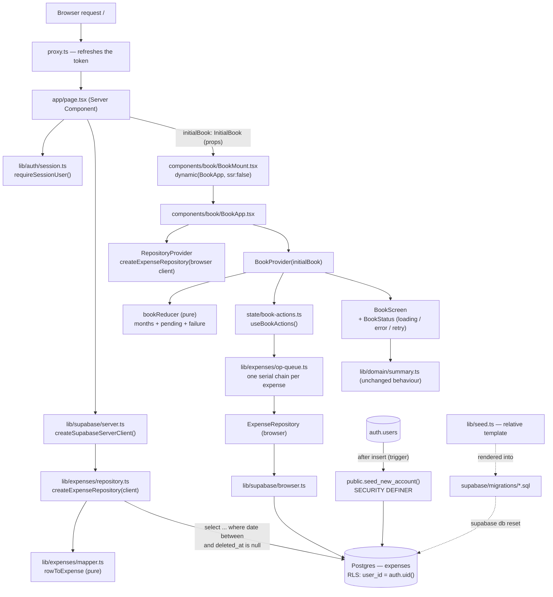

# Design — Supabase expense persistence

**Status:** In review
**Date:** 2026-09-04
**Requirements:** ./requirements.md

## Overview

The book stops being a seed file and becomes a table. Ownership is enforced by
Postgres row-level security on `expenses.user_id`, so criterion 2.4 is satisfied
by the database rather than by discipline in application code, and every other
ownership criterion follows from it: there is no query in this design that has
to remember to filter by account, because a query that forgot would return
nothing.

Reads and writes take **different paths on purpose**. The first read happens on
the server: `app/page.tsx` is already an `async` Server Component that awaits
`requireSessionUser()`, and it now awaits the two-month window in the same
render and hands it to the client as props. That is the whole answer to
requirement 3 — the book cannot appear before its data because the data is part
of what makes it appear. Writes happen from the browser with `supabase-js`
against the same RLS policies, optimistically, so requirement 5's ten seconds
are never spent waiting on a round trip.

Everything between the database row and the domain `Expense` is one pure
mapper, and everything between the store and Supabase is one injected
`ExpenseRepository` interface. Both exist because the test harness is vitest +
jsdom with no running stack: a seam that can be faked is the only way the
thirty-odd behavioural criteria of requirements 4 through 9 get tested at all.
This mirrors the `AuthClient` seam the auth feature already established.

The store is where this feature costs the most. `state/book-store.tsx` today
holds one flat `expenses: Expense[]` that is complete by construction, and
`setMonth` is a pure synchronous jump inside it. Neither survives: the store now
holds a **map of months**, each with its own `loading | loaded | error` status,
plus a list of **pending writes** used to reconcile optimistic rows with what
the database eventually says. The reducer stays pure; every asynchronous thing
lives in an actions hook above it and in a small per-expense serial queue, which
is what makes requirement 7 — acting on an expense whose insert has not returned
— a testable unit rather than a race.

The seeded book moves into SQL. A trigger on `auth.users` inserts the
thirty-seven expenses at the moment an account is created, re-dated relative to
that month and the one before it. `lib/seed.ts` survives, but as a *relative*
template that renders the SQL, so the mockup fidelity the v1 tests assert stays
under vitest while the migration file remains the committed artifact
requirement 12 asks for.

## Architecture



**Boundaries.** This feature owns `supabase/migrations/**`,
`supabase/tests/database/**`, `lib/expenses/**`, the new shape of
`state/book-store.tsx` and `state/book-actions.ts`, and the seed template in
`lib/seed.ts`. It *changes* three things it does not own: `lib/domain/types.ts`
(`amountCop` becomes `amount` + `currency`), `app/page.tsx` (gains the window
read) and `components/book/BookScreen.tsx` (gains the loading and error
surfaces). It *reuses without changing* `lib/supabase/server.ts`,
`lib/supabase/browser.ts`, `lib/auth/session.ts`, `proxy.ts`,
`lib/domain/dates.ts` and `lib/domain/categories.ts`.

**Constraints from the existing codebase that shaped this structure.**

1. **The book is `ssr: false`.** `BookMount` loads `BookApp` with
   `dynamic(..., { ssr: false })` because the day strips depend on the viewer's
   own `today`. Props still cross that boundary — `BookMount` is an ordinary
   client component receiving serialized props from the server — so the window
   travels as props, but only as **plain JSON-serializable data**. `InitialBook`
   is therefore a flat object of strings, numbers and arrays, and nothing else.
2. **`app/__tests__/no-stray-colours.test.ts` whitelists which modules may
   import Supabase**, and lists `lib/supabase`, `lib/auth` and
   `components/entrada`. `lib/expenses/repository.ts` and `app/page.tsx` are new
   legitimate importers. The guard is widened, deliberately and by name — see
   *Widen the Supabase-import whitelist rather than exempt the caller*.
3. **Postgres 17.** `uuidv7()` is a Postgres 18 builtin and does not exist here,
   which is why `uuid_generate_v7()` is a function this feature must define.
4. **`supabase/migrations/` does not exist yet.** `supabase/` holds only
   `config.toml` and `templates/magic_link.html`. `[db.migrations] enabled` and
   `[db.seed] enabled` are already true in `config.toml`, so `supabase db reset`
   will apply what we add with no configuration change (12.2, 12.3).
5. **vitest cannot execute SQL.** Database behaviour — the bit layout of
   `uuid_generate_v7()`, the four RLS policies, the seed trigger — is verified
   with pgTAP files under `supabase/tests/database/`, run by `supabase test db`.
   vitest's contribution is static: it asserts the committed migrations contain
   the statements the design names, and that the rendered seed matches the
   template. Neither replaces the other.
6. **The summary functions are pure and already correct.** Nothing about the
   month total, the daily average, the breakdown or the "comparativo" changes.
   They read `e.amount` instead of `e.amountCop` and are otherwise untouched,
   which is what keeps the v1 criteria they satisfy satisfied.

## Components and interfaces

### `supabase/migrations/<ts>_uuid_generate_v7.sql`

- **Responsibility:** produce a UUIDv7 in Postgres, so that every expense
  identifier sorts in creation order.
- **Interface:**

```sql
create or replace function public.uuid_generate_v7()
returns uuid
language plpgsql
volatile
as $$
declare
  ts_ms bigint := (extract(epoch from clock_timestamp()) * 1000)::bigint;
  bytes bytea := uuid_send(gen_random_uuid());
begin
  -- Bytes 0-5: the 48-bit big-endian millisecond timestamp. int8send yields
  -- eight bytes; the low six are the ones that matter until the year 10889.
  bytes := overlay(bytes placing substring(int8send(ts_ms) from 3 for 6) from 1 for 6);
  -- Byte 6, high nibble: version 7 (0x70), low nibble left random.
  bytes := set_byte(bytes, 6, (get_byte(bytes, 6) & 15) | 112);
  -- Byte 8, top two bits: RFC 4122 variant (0b10), rest left random.
  bytes := set_byte(bytes, 8, (get_byte(bytes, 8) & 63) | 128);
  return encode(bytes, 'hex')::uuid;
end;
$$;
```

- **Traces to:** 10.8, 12.1

The published plpgsql UUIDv7 snippets disagree with each other about which bits
they set, so this one is not trusted on sight: its pgTAP test asserts the
version nibble is `7`, that the variant nibble is one of `8 9 a b`, and that a
hundred ids generated in sequence come back in ascending order when sorted as
uuid.

### `supabase/migrations/<ts>_expenses.sql`

- **Responsibility:** the table, its index, its ownership rules and its
  `updated_at` upkeep.
- **Interface:**

```sql
create table public.expenses (
  id          uuid primary key default public.uuid_generate_v7(),
  user_id     uuid not null default auth.uid()
                references auth.users(id) on delete cascade,
  amount      numeric(14,2) not null check (amount > 0),
  currency    text not null default 'COP',
  category_id text not null,          -- deliberately NO enum and NO check (11.1)
  description text check (description is null or length(btrim(description)) > 0),
  date        date not null,
  created_at  timestamptz not null default now(),
  updated_at  timestamptz not null default now(),
  deleted_at  timestamptz
);

create index expenses_user_date_idx
  on public.expenses (user_id, date desc) where deleted_at is null;

alter table public.expenses enable row level security;

create policy expenses_select on public.expenses
  for select using (user_id = (select auth.uid()));
create policy expenses_insert on public.expenses
  for insert with check (user_id = (select auth.uid()));
create policy expenses_update on public.expenses
  for update using (user_id = (select auth.uid()))
              with check (user_id = (select auth.uid()));
create policy expenses_delete on public.expenses
  for delete using (user_id = (select auth.uid()));

create or replace function public.set_updated_at()
returns trigger language plpgsql as $$
begin
  new.updated_at := now();
  return new;
end;
$$;

create trigger expenses_set_updated_at
  before update on public.expenses
  for each row execute function public.set_updated_at();
```

- **Traces to:** 1.1, 1.5, 2.1, 2.2, 2.3, 2.4, 6.10, 10.1, 10.2, 10.4, 10.5,
  10.6, 10.7, 11.1, 12.1, 12.2, 12.3

Three details are load-bearing. `user_id default auth.uid()` means the client
never sends an owner, so it cannot send the wrong one. `(select auth.uid())` is
the subquery form: the planner evaluates it once per statement instead of once
per row, which matters the moment a month is more than a handful of rows. And
the `DELETE` policy exists even though this feature never issues a `DELETE` —
its absence would be a hole to fill later rather than a rule already stated,
and 6.10 is enforced by the application never issuing one.

### `supabase/migrations/<ts>_seed_new_account.sql`

- **Responsibility:** give a brand-new account the seeded book, once, without
  ever being able to block sign-in.
- **Interface:**

```sql
create or replace function public.seed_new_account()
returns trigger
language plpgsql
security definer
set search_path = public
as $$
declare
  created_month date := date_trunc('month', new.created_at)::date;
begin
  insert into public.expenses (user_id, amount, currency, category_id, description, date, created_at)
  select
    new.id,
    t.amount,
    'COP',
    t.category_id,
    t.description,
    -- Clamp the day to the length of the target month, so a 31st never falls
    -- off the end of a shorter month.
    (created_month + (t.month_offset || ' month')::interval)::date
      + (least(
           t.day,
           extract(day from (date_trunc('month', created_month + (t.month_offset || ' month')::interval)
                             + interval '1 month - 1 day'))::int
         ) - 1),
    new.created_at + (t.sequence || ' second')::interval
  from (values
    -- rendered from lib/seed.ts: (month_offset, day, amount, category_id, description, sequence)
    (-1, 1, 132400, 'mercado', 'Éxito Poblado', 1)
    -- ... 36 more rows
  ) as t(month_offset, day, amount, category_id, description, sequence);

  return new;
exception
  when others then
    -- 8.6: a failed seed must never abort the insert into auth.users, which
    -- would turn "the examples did not load" into "you cannot sign in".
    return new;
end;
$$;

create trigger on_auth_user_created
  after insert on auth.users
  for each row execute function public.seed_new_account();
```

- **Traces to:** 8.1, 8.2, 8.3, 8.4, 8.5, 8.6, 8.7, 12.1

The `exception when others` block is a plpgsql subtransaction: a failure rolls
back the thirty-seven inserts and nothing else, and `new` is returned so the
account is still created. `security definer` is required because the trigger
runs during account creation, when there is no `auth.uid()` to satisfy the
insert policy; `search_path` is pinned so a definer function cannot be
redirected. Nothing in the migration backfills existing rows in `auth.users`,
which is 8.7 expressed as an absence.

### `lib/seed.ts` — the relative seed template

- **Responsibility:** hold the thirty-seven example expenses as offsets rather
  than dates, and render them as the SQL `values` list the migration embeds.
- **Interface:**

```ts
export interface SeedRow {
  /** 0 = the month the account was created in, -1 = the month before it (8.2). */
  monthOffset: 0 | -1;
  /** Day of month, 1-31; clamped by the trigger to the month's real length. */
  day: number;
  amount: number;
  categoryId: CategoryId;
  description: string;
  /** Orders rows within a day; becomes `created_at + n seconds` (1.3). */
  sequence: number;
}

export const SEED_TEMPLATE: readonly SeedRow[];

/** The `values (...)` lines of the seed migration, one row per line. */
export function renderSeedValues(rows?: readonly SeedRow[]): string;
```

- **Traces to:** 8.1, 8.2, 8.3, 12.1

`SEED_EXPENSES` and `SEED_MONTH` are deleted with the store's
`createInitialState`; the mockup-fidelity assertions in
`lib/__tests__/seed.test.ts` are rewritten against `SEED_TEMPLATE` — the August
total of `$1.412.300` and the eight September rows are still asserted, now as
"the previous month" and "the creation month".

### `lib/expenses/mapper.ts`

- **Responsibility:** translate between a database row and a domain `Expense`,
  purely.
- **Interface:**

```ts
export interface ExpenseRow {
  id: string;
  /** PostgREST renders `numeric` as a JSON number; a string is tolerated. */
  amount: number | string;
  currency: string;
  category_id: string;
  description: string | null;
  date: string;        // YYYY-MM-DD, already exactly an IsoDate
  created_at: string;  // timestamptz
}

export interface ExpenseInsert {
  amount: number;
  currency: Currency;
  category_id: CategoryId;
  description: string | null;
  date: IsoDate;
}

export function rowToExpense(row: ExpenseRow): Expense;
export function draftToInsert(draft: ExpenseDraft): ExpenseInsert;
/** Anything outside the five known ids becomes "otros" (11.3). */
export function normalizeCategory(raw: string): CategoryId;
export function toEpochMs(timestamptz: string): number;
```

- **Traces to:** 1.2, 10.2, 10.5, 10.6, 11.2, 11.3, 11.4

`row.date` is passed through as a string and never parsed into a `Date`. That
is not a stylistic preference: it is the only reason no timezone can move an
expense into another day (10.6), and it is the same rule `lib/domain/dates.ts`
already states.

### `lib/expenses/repository.ts`

- **Responsibility:** every statement this feature sends to Supabase, behind one
  interface that a test can implement.
- **Interface:**

```ts
export interface ExpenseRepository {
  /** `month` and the month before it, deleted rows excluded (3.3, 4.1). */
  readWindow(month: MonthKey): Promise<Expense[]>;
  create(draft: ExpenseDraft): Promise<Expense>;
  update(id: string, draft: ExpenseDraft): Promise<Expense>;
  /** Sets `deleted_at = now()`; the row survives (6.10). */
  softDelete(id: string): Promise<void>;
  /** Clears `deleted_at`; the undo of a soft deletion (6.5). */
  restore(id: string): Promise<void>;
  /**
   * A row matching this draft created at or after `sinceIso`. Used only before
   * retrying a failed create, so that a write that actually landed is adopted
   * instead of duplicated (5.7).
   */
  findRecentMatch(draft: ExpenseDraft, sinceIso: string): Promise<Expense | null>;
}

export function createExpenseRepository(client: SupabaseClient): ExpenseRepository;
```

- **Traces to:** 1.1, 1.4, 1.5, 2.2, 5.7, 6.10

`readWindow` selects on `date >= firstDayOf(previousMonth(month))` and
`date <= lastDayOf(month)` with `deleted_at is null`, ordered by
`date desc, created_at desc` — which is the index's order and also the order
`groupByDay` wants (1.3). It filters on no `user_id`: RLS does that, and a
query that named the account would be a second place for that rule to be wrong.

### `lib/expenses/op-queue.ts`

- **Responsibility:** run the operations belonging to one expense strictly in
  order, and let a provisional key be renamed to a real one mid-flight.
- **Interface:**

```ts
export interface OpQueue {
  /** Appends to `key`'s chain; resolves with the task's own result. */
  run<T>(key: string, task: () => Promise<T>): Promise<T>;
  /** Moves a chain onto a new key once the database supplies the real id. */
  rename(from: string, to: string): void;
  /** The real id for a provisional one, or the id itself if it is already real. */
  resolve(key: string): string;
}

export function createOpQueue(): OpQueue;
```

- **Traces to:** 5.3, 5.7, 7.3, 7.4

This is the whole of requirement 7's machinery, and it is deliberately not React:
an edit issued while the insert is in flight is queued behind it and looks up
its id at execution time, so it can never be sent with a provisional id and can
never be applied to a different expense.

### `state/book-store.tsx` — the new `BookState`

- **Responsibility:** hold the months that have been read, what is in flight,
  and what failed — as a pure reducer.
- **Interface:**

```ts
export type MonthStatus = "loading" | "loaded" | "error";

export interface MonthSlice {
  status: MonthStatus;
  /** Empty while loading or after a failure; never mistaken for "no spending". */
  expenses: Expense[];
}

export type PendingOp =
  | { opId: string; kind: "create"; localId: string; draft: ExpenseDraft; startedAt: string }
  | { opId: string; kind: "update"; id: string; draft: ExpenseDraft; before: Expense }
  | { opId: string; kind: "delete"; id: string; before: Expense }
  | { opId: string; kind: "restore"; id: string; before: Expense };

export interface WriteFailure {
  /** What the user is told, in Spanish. */
  message: string;
  /** The operation to run again, unchanged, if they ask for it (5.5, 6.9, 7.5). */
  op: PendingOp;
}

export interface BookState {
  /** Only months that have been read or are being read appear here. */
  months: Record<MonthKey, MonthSlice>;
  viewedMonth: MonthKey;
  filter: CategoryFilterValue;
  sheet: SheetState;
  pendingDeletion: Expense | null;
  today: IsoDate;
  pending: PendingOp[];
  failure: WriteFailure | null;
}

export type BookAction =
  | { type: "setMonth"; month: MonthKey }
  | { type: "monthLoading"; month: MonthKey }
  | { type: "monthLoaded"; months: MonthKey[]; expenses: Expense[] }
  | { type: "monthFailed"; months: MonthKey[] }
  | { type: "reconcile"; months: MonthKey[]; expenses: Expense[] }
  | { type: "setFilter"; filter: CategoryFilterValue }
  | { type: "openSheet"; sheet: Exclude<SheetState, { mode: "closed" }> }
  | { type: "closeSheet" }
  | { type: "register"; op: Extract<PendingOp, { kind: "create" }> }
  | { type: "adoptId"; localId: string; expense: Expense }
  | { type: "edit"; op: Extract<PendingOp, { kind: "update" }> }
  | { type: "delete"; op: Extract<PendingOp, { kind: "delete" }> }
  | { type: "undoDelete" }
  | { type: "finalizeDelete" }
  | { type: "opSettled"; opId: string }
  | { type: "opFailed"; opId: string; message: string }
  | { type: "dismissFailure" };

/** Everything the header and the list need for `month`: it and the month before. */
export function windowExpenses(state: BookState, month: MonthKey): Expense[];
export function windowStatus(state: BookState, month: MonthKey): MonthStatus;
export function createInitialState(initial: InitialBook): BookState;
```

- **Traces to:** 3.1, 3.5, 4.1, 4.2, 4.3, 4.4, 5.1, 5.2, 5.3, 6.1, 6.3, 6.5,
  7.1, 7.2, 9.3, 9.4

`windowExpenses` is what `BookScreen` passes to every summary function, so the
existing pure functions keep working on a flat list and never learn that months
arrive separately. `windowStatus` is the worst status of the two months in the
window: a month whose "comparativo" is still loading is not a month whose
figures may be presented as final (4.2).

### `state/book-actions.ts`

- **Responsibility:** the asynchronous half — dispatch the optimistic action,
  send the statement, dispatch the resolution.
- **Interface:**

```ts
export interface BookActions {
  register(draft: ExpenseDraft): void;
  edit(id: string, draft: ExpenseDraft): void;
  remove(id: string): void;
  undoDelete(): void;
  goToMonth(month: MonthKey): void;
  /** Re-reads the current window; used on mount-mismatch and on refocus (9.2). */
  refresh(): void;
  retryFailure(): void;
  dismissFailure(): void;
}

export function useBookActions(): BookActions;
```

- **Traces to:** 4.1, 4.4, 5.1, 5.4, 5.5, 6.1, 6.2, 6.4, 6.8, 6.9, 7.5, 9.1,
  9.2, 9.5

The repository comes from a `RepositoryProvider` mounted in `BookApp`, so a
component test can supply a fake with no Supabase client anywhere in the tree.

### `components/book/BookStatus.tsx`

- **Responsibility:** the two states the book never had — loading a month, and
  failing to load one — plus the failed-write notice and its retry.
- **Interface:**

```ts
export function MonthLoading({ month }: { month: MonthKey }): JSX.Element;

export function MonthError({
  month,
  onRetry,
}: { month: MonthKey; onRetry: () => void }): JSX.Element;

export function WriteFailureToast({
  failure,
  onRetry,
  onDismiss,
}: { failure: WriteFailure; onRetry: () => void; onDismiss: () => void }): JSX.Element;
```

- **Traces to:** 3.6, 4.2, 4.4, 5.4, 5.5, 6.2, 6.8, 6.9, 7.5

Built from the existing tokens and the existing `UndoToast` layout; no new
colour enters the app, which is what keeps `app/__tests__/no-stray-colours.test.ts`
green.

### `app/page.tsx`

- **Responsibility:** read the window on the server and hand it to the client
  already complete.
- **Interface:**

```ts
export interface InitialBook {
  /** The month the server opened on, from the server's own date (3.4). */
  month: MonthKey;
  today: IsoDate;
  /** `month` and the month before it, already mapped. Empty when `error`. */
  expenses: Expense[];
  /** True when the read failed; the client shows the retry, not an empty book. */
  error: boolean;
}
```

- **Traces to:** 2.5, 3.1, 3.2, 3.3, 3.4, 3.6

`InitialBook` is plain JSON — strings, numbers, arrays — because it crosses the
Server/Client boundary into a component that is itself `ssr: false`. No `Date`,
no `Map`, no class instance may enter it.

## Data models

```ts
// lib/domain/types.ts — the change that ripples everywhere
export type Currency = "COP";
export const DEFAULT_CURRENCY: Currency = "COP";

export interface Expense {
  id: string;
  /** Was `amountCop`. Whole Colombian pesos in this version (10.3). */
  amount: number;
  /** Stored alongside the amount; always "COP" for now (10.2, 10.3). */
  currency: Currency;
  categoryId: CategoryId;
  /** Absent when the user did not write one — never an empty string (10.5). */
  description?: string;
  date: IsoDate;
  /** Epoch ms, from the row's `created_at`; orders a "jornada" (1.3). */
  createdAt: number;
}

/** The sheet still produces neither an id, a timestamp nor a currency. */
export type ExpenseDraft = Omit<Expense, "id" | "createdAt" | "currency">;
```

```sql
-- The stored shape. See the migration components above for the full DDL.
expenses(id uuid pk, user_id uuid not null, amount numeric(14,2) > 0,
         currency text default 'COP', category_id text, description text,
         date date, created_at timestamptz, updated_at timestamptz,
         deleted_at timestamptz null)
```

**Validation rules and invariants**

- `amount > 0` is a database `check`, and the sheet already refuses to confirm
  a zero amount — two locks, because 10.4 asks the *system* to reject it, not
  the form — traces to 10.4
- `description` is either `null` or a non-blank string; the mapper turns `""`
  and whitespace into `null` on the way down and into `undefined` on the way up
  — traces to 10.5
- `currency` is `"COP"` on every row this version writes; nothing in the UI
  offers a choice and no total mixes currencies — traces to 10.2, 10.3
- `category_id` is unconstrained in the database and constrained in TypeScript:
  only the five ids are ever written, and anything else read back is presented
  as `"otros"` with its amount intact — traces to 11.1, 11.2, 11.3, 11.4
- `date` is a Postgres `date`, which serializes as `YYYY-MM-DD` — byte for byte
  the `IsoDate` the app already uses — and is never converted — traces to 10.6
- `user_id` is never sent by a client; it defaults to `auth.uid()` and RLS
  checks it on all four verbs — traces to 2.1, 2.2, 2.3, 2.4
- `deleted_at is null` is part of every read; no soft-deleted row reaches a
  list, a total or an aggregate — traces to 6.7
- No row is ever deleted with `DELETE` — traces to 6.10
- `id` is a UUIDv7 generated in Postgres, so ids sort in creation order; the
  client's provisional id is never stored — traces to 10.8, 5.3
- An `Expense` in the store belongs to exactly one `MonthSlice`, the one for
  `monthKeyOf(e.date)`; an edit that changes the month moves the row between
  slices — traces to 1.4, 5.6
- Amounts are whole pesos below 10^9, so summing them as IEEE doubles is exact;
  storage is `numeric(14,2)`, which is exact by construction — traces to 10.1

## Data flow

### Scenario: opening the app (Requirement 3)

1. The browser requests `/` → `proxy.ts` refreshes the token and lets it pass.
2. `app/page.tsx` awaits `requireSessionUser()` → a `SessionUser`, or a redirect
   to `/entrada` before any expense figure exists (2.5).
3. The same render awaits `createSupabaseServerClient()`, builds the repository
   and calls `readWindow(monthKeyOf(todayIso()))` → one `select` for the two
   months, filtered by RLS to this account (2.2), `deleted_at is null` (6.7).
4. Rows go through `rowToExpense`; unknown categories become `"otros"` (11.3).
5. `InitialBook` is passed to `BookMount` → `BookApp` → `BookProvider`, whose
   `createInitialState` marks both months `loaded` and sets `viewedMonth` to the
   current month (3.4).
6. `BookScreen` renders from `windowExpenses(state, viewedMonth)`. Total,
   average, top category, breakdown and "comparativo" are computed during that
   first render — satisfies 3.1, 3.2, 3.3.
7. On mount, the client compares its own `todayIso()` with the served `today`.
   If the months differ — a timezone straddling a month boundary — it dispatches
   `setMonth` for the client's month, which takes the ordinary not-yet-loaded
   path below.
8. An account with no rows at all yields two `loaded` months with no expenses,
   so `BookScreen` shows the existing empty state, not a spinner — satisfies 3.5.

### Scenario: registering an expense (Requirements 5 and 7)

1. The user confirms the sheet → `useBookActions().register(draft)`.
2. `register` mints a provisional id, dispatches `register` with a `create` op:
   the sheet closes, the row appears in its "jornada", and `viewedMonth` follows
   the expense's month — satisfies 5.1, 5.6. The row is an ordinary `Expense`,
   so every aggregate already includes it — satisfies 5.2.
3. `opQueue.run(localId, () => repository.create(draft))` sends the insert with
   `.select().single()`.
4. The user edits the same expense before the insert returns. `edit` dispatches
   optimistically (7.1, 7.2) and queues behind the create under the same key.
5. The insert resolves → `adoptId` replaces the provisional row with the
   returned one, in place: same `date`, same `createdAt` ordering, same values,
   so nothing moves or flickers — satisfies 5.3. `opQueue.rename(localId, realId)`
   records the mapping.
6. The queued edit now runs, calls `opQueue.resolve(localId)` → the real id, and
   updates the row the user actually acted on — satisfies 7.3, 7.4.
7. `opSettled` removes the ops from `state.pending`.

### Scenario: deleting, and closing the tab during the undo window (Requirement 6)

1. `remove(id)` dispatches `delete`: the row leaves the book at once, the
   filter falls back if it emptied, `pendingDeletion` holds the expense and the
   `UndoToast` appears — satisfies 6.3, 6.7.
2. **The `softDelete` is sent immediately**, not when the timer expires.
3. The user closes the tab. The row is already `deleted_at`-stamped, so the
   next read does not return it — satisfies 6.6, and 6.4 a fortiori.
4. Had they pressed undo instead, `undoDelete` restores the expense to the
   store — order derives from `date` and `createdAt`, so it lands exactly where
   it was (6.5) — and queues a `restore` that clears `deleted_at`.

### Scenario: a failed write (error path)

1. `repository.create` rejects.
2. `opFailed` removes the optimistic row from its slice and sets `state.failure`
   with a Spanish message and the op itself.
3. `WriteFailureToast` shows the message and "Reintentar"; the sheet reopens
   pre-filled with the draft that failed, so nothing typed is lost — satisfies
   5.4, 5.5.
4. `retryFailure()` first calls `findRecentMatch(draft, op.startedAt)`. A match
   means the original insert actually landed despite the error: it is adopted,
   not re-inserted — satisfies 5.7.

### Scenario: returning to the tab (Requirement 9)

1. `visibilitychange` fires with `document.visibilityState === "visible"` →
   `refresh()`.
2. `readWindow(viewedMonth)` returns the server's current rows.
3. `reconcile` replaces each month's slice with the server rows, then re-applies
   what is still in `state.pending`: provisional rows are kept, locally deleted
   rows stay out, locally edited rows keep their local values — satisfies 9.3,
   9.4.
4. A failed re-read dispatches nothing at all; the slices keep their data and
   their `loaded` status — satisfies 9.5.

## Error handling

| Condition | Handling | Related requirement |
|---|---|---|
| The user signs out and back in on the same device | Nothing is cached in the browser; the server reads the window again for that account and the same expenses come back | 1.6 |
| A request touches an expense owned by another account | RLS returns zero rows for a read and refuses the write, whatever the caller — the app never filters by `user_id` itself | 2.3 |
| There is no session | `requireSessionUser()` redirects to `/entrada` before the window is read, so no total, average or comparison is ever computed | 2.5 |
| The account has no expenses at all | Both months are `loaded` and empty → the existing empty state for the current month, not an error and not a spinner | 3.5 |
| The server-side window read throws | `InitialBook.error = true`; the book renders with `MonthError` and "Reintentar", never an empty book showing `$0` | 3.6 |
| A month read fails after navigation | That month's slice becomes `error`; `MonthError` offers a retry and the previously viewed month's slices are untouched | 4.4 |
| The insert fails | The optimistic row is removed, `WriteFailureToast` says it could not be saved, and the sheet reopens with the entry intact | 5.4 |
| The user asks to retry a failed insert | The stored op is run again with the same draft, no retyping | 5.5 |
| A retried insert would duplicate a write that actually landed | `findRecentMatch(draft, startedAt)` is consulted first; a match is adopted instead of inserted | 5.7 |
| The update fails | `before` is restored into the slice and the user is told the change was not saved | 6.2 |
| The tab closes during the undo window | The soft delete was already sent, so the row does not come back | 6.6 |
| The soft delete fails | The expense returns to the book and the user is told it was not deleted | 6.8 |
| The user asks to retry a failed edit or deletion | The stored op is run again, unchanged | 6.9 |
| A queued action cannot be applied — its create failed, so its target never existed | The queued op is dropped with an explicit message, the book is left showing what is actually stored, and a retry is offered | 7.5 |
| Seeding fails during account creation | The `exception when others` block swallows it; the account exists and the user enters an empty book | 8.6 |
| A re-read fails | Nothing is dispatched; the book keeps the data it has | 9.5 |
| A row's `category_id` is not one of the five | `normalizeCategory` presents it as `"otros"` instead of failing to render | 11.3 |
| That row's amount | Counts in the month total and every aggregate, because it is an ordinary `Expense` under `"otros"` | 11.4 |

## Testing strategy

**Unit (vitest)**

- `rowToExpense` / `draftToInsert` round trips, including `null` ↔ `undefined`
  description and numeric-as-string amounts — covers 1.2, 10.2, 10.5, 10.6
- `normalizeCategory` on the five known ids and on `"cripto"` — covers 11.2, 11.3
- The summary functions over expenses carrying `amount` instead of `amountCop`,
  with the v1 expectations unchanged — covers 10.1, 10.3
- `bookReducer`: month slices and statuses, `setMonth` into an unloaded month,
  back into a loaded one, and never past today — covers 4.1, 4.2, 4.3, 4.5
- `bookReducer`: optimistic register, `adoptId`, `opFailed` rollback, delete and
  undo — covers 5.1, 5.2, 5.3, 6.1, 6.3, 6.5, 7.1, 7.2
- `reconcile` with a provisional row, a locally deleted row and a locally edited
  row in flight — covers 9.3, 9.4
- `createOpQueue`: ordering under one key, `rename` mid-flight, `resolve` —
  covers 5.3, 7.3, 7.4
- `renderSeedValues` against the committed migration file — covers 8.1, 8.2, 8.3
- A static read of the migration files asserting RLS is enabled, four policies
  exist, the index is partial and no `check` constrains `category_id` — covers
  2.4, 11.1, 12.1

**Edge cases**

- A window read returning rows from both months, one month, and none — covers
  3.3, 3.5
- A month whose previous month is still loading: `windowStatus` is `loading`
  and no figure is presented as final — covers 4.2
- The client's `today` in a different month than the server's — covers 3.4
- Day 31 of a template row landing in a 28-day month (the clamp), asserted in
  pgTAP against an account created in March — covers 8.2
- An amount of `0` and a blank description rejected at both boundaries — covers
  10.4, 10.5

**Integration (vitest + Testing Library, fake repository)**

- Mounting `BookApp` with an `InitialBook` and asserting every header figure on
  the first render, with no second paint — covers 3.1, 3.2
- Registering with a repository whose `create` never resolves, then editing and
  deleting that row — covers 5.1, 5.2, 7.1, 7.2
- Registering with a rejecting repository: the row disappears, the message
  appears, the sheet comes back filled, the retry succeeds — covers 5.4, 5.5
- Editing and deleting against a rejecting repository — covers 6.2, 6.8, 6.9, 7.5
- Navigating to an unloaded month, to a failing month, and back — covers 4.1,
  4.3, 4.4
- Firing `visibilitychange` and asserting the window is re-read and merged —
  covers 9.1, 9.2, 9.3, 9.5

**Database (pgTAP, `supabase test db`)**

- `uuid_generate_v7()`: version nibble `7`, RFC 4122 variant, 100 ids ascending
  — covers 10.8
- Two accounts: each sees only its own rows on select, cannot update or delete
  the other's, and cannot insert with a forged `user_id` — covers 2.1, 2.2,
  2.3, 2.4
- `amount <= 0` and a blank description are rejected — covers 10.4, 10.5
- `category_id = 'cripto'` is accepted by the database — covers 11.1
- An update bumps `updated_at` and leaves `created_at` alone — covers 10.7
- Inserting into `auth.users` yields exactly 37 rows across two months, and a
  second sign-in adds none — covers 8.1, 8.2, 8.3, 8.5
- A user row inserted with the seed function made to fail still commits —
  covers 8.6
- An account created before the migration has no rows after it — covers 8.7

**Manual (documented pass)**

- `supabase db reset` from a clean checkout reproduces the schema with no
  dashboard step — covers 12.2, 12.3
- Sign in as a new account, register, edit, delete, reload; sign out, sign in as
  a second account and confirm the first account's book is nowhere — covers
  1.1, 1.4, 1.5, 1.6, 2.6, 8.4

## Design decisions and trade-offs

### Reads on the server, writes from the client

- **Rationale:** requirement 3 wants the book complete at first paint, which
  only a server read can guarantee — a `useEffect` read is by definition a
  second paint. Requirement 5 wants the write invisible, which only a client
  write can give: a Server Action costs a round trip before the reducer can even
  be told. Splitting them buys both, and costs one extra Supabase client, which
  already exists.
- **Alternative considered:** all writes as Server Actions. It would centralise
  the statements and let the sheet post without JS, but every optimistic update
  would then be a `useOptimistic` over a transition whose failure semantics are
  harder to express than requirement 5.4's, and requirement 7 — acting on an
  unconfirmed row — becomes an ordering problem across two runtimes instead of
  one queue in the browser.

### The soft delete is sent immediately, not when the undo window expires

- **Rationale:** 6.6 says a tab closed during the window makes the deletion
  final. If the statement waited for the timer, closing the tab would leave the
  row alive and it would reappear on the next read, which is exactly what 6.6
  forbids. Sending it at once satisfies 6.6 and satisfies 6.4 early; undo
  becomes a `restore` rather than a cancellation.
- **Alternative considered:** hold the statement for the five seconds and fire
  it on expiry, with a `beforeunload` flush. `beforeunload` cannot await a
  request; the flush would be best-effort, and 6.6 would hold only when the
  network was fast enough. A guarantee that depends on luck is not one.

### Seeding by trigger on `auth.users`, not on first sign-in

- **Rationale:** the trigger fires exactly once per account, inside the
  transaction that creates it, which is 8.5 with no marker column and no race
  between two tabs signing in at the same moment. It never runs for an account
  that already exists, which is 8.7 with no extra rule. And its
  `exception when others` block is a subtransaction, so a broken seed rolls back
  the expenses and still returns `new` — 8.6 without a `try/catch` in the
  sign-in path.
- **Alternative considered:** a server-side seed on first sign-in. It would be
  ordinary TypeScript, testable under vitest, and would need no `security
  definer` function. But "first" has to be stored somewhere — a flag on the
  row, or a count query — and two simultaneous sign-ins can both read "not yet
  seeded", which is 8.5 broken by a race that is hard to reproduce and easy to
  ship. It also puts a 37-row insert on the path requirement 3 wants fast.

### `lib/seed.ts` renders the SQL instead of being replaced by it

- **Rationale:** the seed's fidelity to the mockup is asserted today by
  `lib/__tests__/seed.test.ts` — the August total, the eight September rows. If
  the data moved into a `.sql` file, those assertions would be unrunnable under
  vitest and would simply be deleted, which is how the numbers in the mockup
  quietly stop matching the numbers in the app. Keeping the table in TypeScript
  and rendering the `values` list keeps them testable; a test comparing the
  render to the committed migration keeps the two honest.
- **Alternative considered:** write the 37 rows directly in the migration and
  delete `lib/seed.ts`. Simpler by one indirection, at the cost of the only
  tests that tie the seeded book to the design.

### Widen the Supabase-import whitelist rather than exempt the caller

- **Rationale:** `app/__tests__/no-stray-colours.test.ts` asserts that only
  `lib/supabase`, `lib/auth` and `components/entrada` import Supabase. That
  encoded v1's "no expense data leaves the device", which this feature makes
  false on purpose. The honest change is to add `lib/expenses` and `app/page.tsx`
  to the list by name and delete the "persists no expense in the browser" clause
  that no longer describes anything — the whitelist keeps its value precisely
  because it stays exhaustive.
- **Alternative considered:** delete the guard. It is the only thing that would
  notice a component reaching for a Supabase client directly instead of going
  through the repository, which is the mistake this design most wants to
  prevent.

### The two-month window as a map of months, not a growing flat list

- **Rationale:** requirement 4.3 — returning to a month must not re-read it —
  needs the store to distinguish "read and empty" from "not read". A flat
  `Expense[]` cannot express that difference, and an empty month would be
  re-read forever or, worse, shown as `$0`. A `Record<MonthKey, MonthSlice>`
  says it in the type.
- **Alternative considered:** keep the flat list plus a `Set<MonthKey>` of
  loaded months. The same information, spread across two fields that can
  disagree; every reducer case would have to update both.

### `Expense.amount` + `currency` instead of `amountCop`

- **Rationale:** 10.2 requires the currency stored alongside the amount, and a
  field named `amountCop` next to a `currency` column is a lie waiting to
  happen. The rename is mechanical and the pure functions' behaviour does not
  change — which is the property the tests must assert.
- **Alternative considered:** keep `amountCop` in the domain and map from
  `amount`/`currency` at the boundary. It would avoid touching every fixture,
  at the price of a domain type that cannot represent what the database stores.
